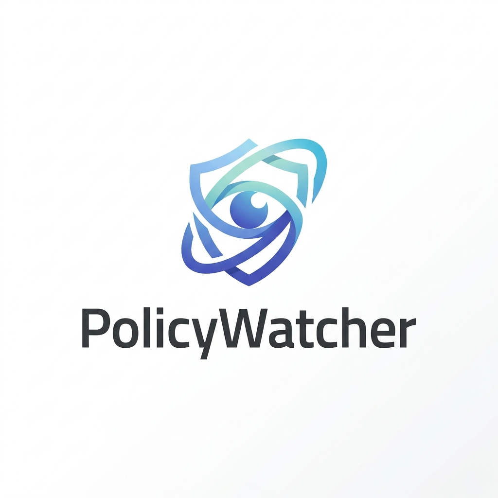
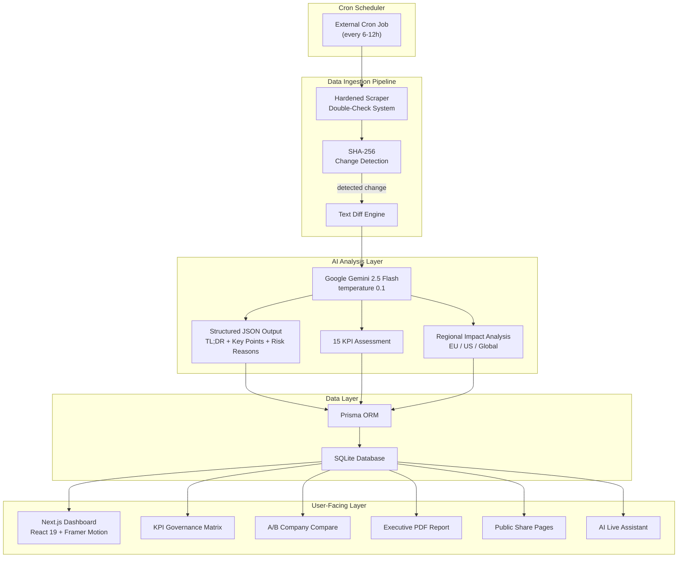
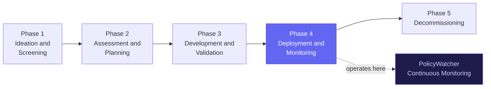
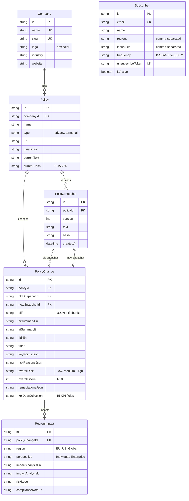

<p align="center">
  
</p>

<h1 align="center">PolicyWatcher</h1>

<p align="center">
  <strong>AI-powered regulatory intelligence platform for Big Tech and FinTech corporate policies.</strong>
</p>

<p align="center">
  <a href="https://creativecommons.org/licenses/by/4.0/"></a>
  <a href="https://www.policywatcher.online"></a>
  
  
  
  
  
</p>

---

## What Is PolicyWatcher?

PolicyWatcher monitors the privacy policies, terms of service, and AI governance practices of 16 major technology and financial companies. It scrapes their public policy pages, detects changes via SHA-256 hashing, and runs each change through Google Gemini for structured bilingual (EN/IT) risk analysis.

The platform is designed as a **civic tech tool** that translates dense legal documents into actionable intelligence for citizens, SMEs, DPOs, and compliance professionals.

### Release 3.2 Highlights

- **Adaptive Fallback Scraper Cascade (5 levels)**: Bypasses datacenter bot-blocking (WAF, Cloudflare, CAPTCHAs) by cascading from direct HTTP/1.1 and explicit HTTP/2 down to Wayback Machine, Google Cache, and Common Crawl indexes.
- **Polite Crawling & Delays**: Random 1-3s delays between policy fetches to avoid rate limit bans.
- **KPI Preservation**: Automatic inheritance of the 15-KPI governance metrics on new scans, preventing database records from resetting to "Not assessed".
- **Data Integrity Repair Script**: `/scripts/repair-data.ts` to recompute SHA-256 hashes, backfill missing AI summaries (TL;DR, keyPointsJson), and restore broken KPI cells in the database.
- Public policy-change timeline with stable `/change/[id]` permalinks.
- Home-page Market Pulse timeline showing recent policy movements by sector.
- Embeddable `/embed/change/[id]` widgets for third-party pages.
- Dynamic Open Graph image generation and sitemap support for better sharing and indexing.
- Rich diff rendering for policy additions, removals, and unchanged context.
- Industry benchmark option in the A/B radar comparison.
- Admin encrypted backup export and verification workflow.
- Admin Dataset QA dashboard for source-fit, integrity, freshness, KPI coverage, regional-impact coverage, and subscriber hygiene checks.
- Pre-release security hardening for secrets, rate limits, AI output rendering, email templates, subscriber tokens, scraper egress, deployment diagnostics, and backup passphrases.

### Key Value Propositions

- **Automated monitoring** of 16 companies across 6 industry sectors, with email alerts on policy changes.
- **Transparent AI scoring** where every risk score (1-10) is explained with concrete reasons and delta contributions.
- **15-KPI governance matrix** covering Privacy, AI Governance, and Ethics with 480 manually curated bilingual justifications.
- **Regional impact analysis** across EU, US, and Global jurisdictions from both Individual and Enterprise perspectives.
- **Bilingual by design** with full native EN/IT support throughout the platform, including all AI outputs.

---

## Monitored Companies

| Sector | Companies |
|--------|-----------|
| **Tech Giants** | Google, Microsoft, Apple, Amazon, Meta |
| **FinTech** | Stripe, PayPal, Revolut, Wise, Klarna, Plaid |
| **AI Providers** | OpenAI, Anthropic |
| **Social Media** | TikTok |
| **Cloud/SaaS** | Salesforce |
| **E-Commerce** | Shopify |

Each company is tracked across multiple policy types: Privacy Policy, Terms of Service, AI Terms, and Acceptable Use Policy where applicable.

---

## Architecture

### System Overview



### Ingestion Pipeline Sequence

```mermaid
sequenceDiagram
    autonumber
    participant Cron as Cron Job / Web Hook
    participant API as API Route (cron/check-all)
    participant Scraper as Scraper v3
    participant Policy as Remote Policy Server
    participant Archive as Web Archives (Wayback / Common Crawl)
    participant DB as SQLite Database
    participant Gemini as Gemini API

    Cron->>API: trigger full check
    loop for each policy
        API->>Scraper: scrapePolicyText(url)
        Scraper->>Policy: GET (Direct HTTP/1.1 / H2)
        alt successful fetch (200 OK / 403 with body)
            Policy-->>Scraper: HTML response
        else blocked (WAF, captcha, short content)
            Scraper->>Archive: Fetch cached snapshot
            Archive-->>Scraper: HTML response
        end
        Scraper->>Scraper: Content validation (Layer 2)
                API->>DB: Update Policy.currentHash
            end
        else Content blocked / unavailable
            Scraper-->>API: { unavailable: true }
            Note over API: Logged honestly, no fake data created
        end
    end
    API->>DB: Fetch active INSTANT subscribers
    API->>Mailer: Send filtered alerts per subscriber
    API-->>Cron: Summary JSON (checked, changed, errors)
```

---

## Methodology

### Risk Score (1-10)

Each monitored policy receives a composite risk score from 1 (very safe) to 10 (critical concerns). The score is generated by Gemini 2.5 Flash with temperature 0.1 for deterministic, factual output.

| Range | Label | Criteria |
|-------|-------|----------|
| 1-3 | Low | Strong user protections, transparent AI practices, explicit consent, quick breach notification, published audit results |
| 4-6 | Medium | Partial protections, some opaque AI practices, opt-out consent flows, moderate data retention |
| 7-10 | High | Extensive data collection, opaque AI training, indefinite retention, broad third-party sharing, no independent audits |

Every score comes with exactly 3 **Risk Reasons** that explain *why* the score is what it is, each with a delta contribution (e.g. `+2`, `-1`).

### The 15 KPIs

Companies are evaluated across 15 Key Performance Indicators organized in three groups:

#### Privacy and Data Protection

| KPI | Green | Yellow | Red |
|-----|-------|--------|-----|
| Data Collection Scope | Minimal | Moderate | Extensive |
| Third-Party Sharing | None / Restricted | Limited / Controlled | Broad / Undisclosed |
| Data Retention | Limited (defined) | Extended | Indefinite |
| Right to Deletion | Full / Available | Partial | Not available |
| Cross-Border Transfer | Restricted | Controlled | Unrestricted |

#### AI Governance

| KPI | Green | Yellow | Red |
|-----|-------|--------|-----|
| AI Training Opt-Out | Available / Not used | Opt-out available | Not available |
| AI Output Ownership | User retained | Shared | Company claimed |
| Algorithmic Transparency | Published / Disclosed | Mentioned / Partial | Opaque / Undisclosed |
| Automated Decisions | Transparent / Human-in-loop | Partial disclosure | Opaque / No review |
| AI Bias and Fairness | Committed / Certified | Mentioned | Absent |

#### Ethics and Corporate Governance

| KPI | Green | Yellow | Red |
|-----|-------|--------|-----|
| Consent Mechanism | Explicit opt-in | Opt-out | Implicit / Bundled |
| Regulatory Compliance | Comprehensive | Partial | Minimal |
| Breach Notification | Within 24h | Within 72h | Unspecified |
| Independent Audit | Certified / Published | Mentioned | Absent / Undisclosed |
| Content Moderation | Transparent | Partial | Opaque |

Each KPI assessment is backed by **480 manually curated bilingual justification strings** (16 companies x 15 KPIs x 2 languages) with a documented screening date.

### Source Selection and Dataset QA

Dataset quality is treated as the platform's operational seal. PolicyWatcher follows this source hierarchy:

- **Global first:** Global analysis should use the canonical English/global source when the company publishes one.
- **Market-specific when available:** EU, US, UK, or other regional analysis should point to the official policy for that market.
- **Localized pages are not primary evidence by default:** translated URLs such as `/it/` are flagged unless they are the only official market source and the jurisdiction label makes that clear.
- **Traceability over convenience:** every monitored policy keeps its source URL, stored snapshot, hash, version history, and detected changes.

The admin **Dataset QA** gate checks URL hygiene, source-fit, hash integrity, freshness, structured AI JSON, KPI coverage, regional-impact coverage, and subscriber hygiene. Critical findings are release blockers; warnings mark ambiguity or drift that should be resolved before public promotion.

### Scraper Integrity (Double-Check System)

The scraper follows a strict "never fabricate" design:

**Layer 1 (Transport):**
- 20-second fetch timeout with 3 retry attempts and exponential backoff.
- User-Agent rotation across 3 browser profiles.
- Redirect following with final-URL validation.

**Layer 2 (Content Validation):**
- Detects Cloudflare challenges, CAPTCHAs, maintenance pages, paywalls, and consent walls.
- Soft-404 detection for pages that return 200 but contain error content.
- Minimum text length enforcement (400 characters).
- Maximum text cap (200K characters).

**Result types:**
- `ok` - valid policy text, stored with SHA-256 hash.
- `unavailable` - temporary issue, flagged honestly with a "visit the official site" message.
- `invalid` - permanently dead link (404/410).

### PALO Framework Integration

PolicyWatcher's methodology is aligned with the **PALO Framework** (Principled AI Lifecycle Orchestration), developed by Fabrizio Degni. PALO synthesizes ISO 42001, the EU AI Act, OECD AI Principles, and NIST AI RMF into a unified operational lifecycle.

PolicyWatcher operates as a continuous **Deployment and Monitoring** tool (Phase 4) while its KPI framework draws from the Ethical KPIs paradigm that PALO advocates: converting abstract ethical principles into measurable, comparable metrics.



---

## Features

### Dashboard
- Interactive company card grid with filtering by industry, risk level, date range, and text search.
- Region/perspective context toggle (EU/US/Global x Individual/Enterprise).
- Real-time stats panel with monitored companies count, critical alerts, and average risk score.
- Skeleton loaders for perceived instant loading.

### Policy Deep-Dive
- 5-tab interface: Changes, AI Governance, Trends, Remediations, Archive.
- AI Summary with TL;DR, sentiment-tagged key points, and risk reason chips.
- Risk Trend Chart with historical data and summary statistics.
- Manual re-scan trigger for on-demand policy analysis.
- Share via Web Share API and downloadable executive PDF report.

### KPI Governance Matrix
- 15 KPIs x 16 companies cross-reference table with color-coded badges.
- Industry filter tabs, search, and toggleable KPI groups.
- Convergence row showing cross-company alignment per KPI.
- Click-to-sort on any KPI column.
- Tooltip justifications with screening date for every cell.

### Company A/B Compare
- Side-by-side comparison with radar/spider chart (Recharts).
- Per-KPI diff table with winner highlight.

### AI Live Assistant
- Conversational Q&A powered by Gemini 2.5 Flash with full policy corpus context.
- Voice input via Web Speech API and voice output via Google Cloud TTS with browser fallback.
- Animated waveform visualizer showing assistant state (idle/listening/processing/speaking).

### Email Notifications
- Real-time alerts on policy changes filtered by subscriber preferences.
- Weekly and monthly digest emails.
- Self-service subscribe/unsubscribe with token-based security.
- Branded HTML email templates.

### Export and Share
- CSV export with flattened company/policy/KPI data.
- Executive PDF report (A4, branded, generated server-side with @react-pdf/renderer).
- Public share pages with Open Graph and Twitter Card metadata.

### Command Palette
- Global overlay search (Cmd+K / Ctrl+K) with fuzzy matching.
- 3 command groups: Actions, Filters, Navigation.
- Full keyboard navigation.

### Onboarding
- 4-slide interactive How To wizard for first-time visitors.
- Session-scoped auto-trigger with permanent skip checkbox.

---

## Tech Stack

| Layer | Technology |
|-------|-----------|
| Framework | Next.js 16.2.9 (App Router, Turbopack) |
| UI | React 19, Framer Motion, Lucide React, CSS Modules |
| AI Engine | Google Gemini 2.5 Flash (`@google/genai`) |
| Database | Prisma ORM + SQLite (migration-ready for PostgreSQL) |
| Scraping | Cheerio (HTML parsing), native fetch with retry |
| Charts | Recharts 3.8 |
| PDF | @react-pdf/renderer 4.5 |
| Email | Nodemailer 9 |
| Export | PapaParse 5.5 |
| TTS | Google Cloud Text-to-Speech API |

---

## Database Schema



---

## API Reference

| Route | Method | Auth | Rate Limit | Purpose |
|-------|--------|------|------------|---------|
| `/api/companies` | GET | No | 60/min | List all companies with policies and latest changes |
| `/api/policies/[id]` | GET | No | 60/min | Full policy detail with snapshots and change history |
| `/api/chat` | POST | No | 10/min | AI Q&A with policy corpus context |
| `/api/scrape` | POST | Bearer | 3/10min | Manual re-scrape and re-analysis of a policy |
| `/api/compare` | GET | No | 60/min | A/B company KPI comparison with radar data |
| `/api/matrix` | GET | No | 60/min | Cross-company KPI matrix data |
| `/api/trends` | GET | No | 60/min | Historical risk score trend data |
| `/api/report/[policyId]` | GET | No | 60/min | Server-side PDF report generation |
| `/api/tts` | POST | No | 10/hr | Google Cloud Text-to-Speech |
| `/api/subscribers` | POST | No | 3/hr | Subscribe to email alerts |
| `/api/subscribers` | DELETE | No | 10/hr | Unsubscribe from email alerts |
| `/api/cron/check-all` | POST | Bearer | None | Full policy check and notification pipeline |
| `/api/cron/weekly` | GET | Bearer | None | Weekly digest email dispatch |
| `/api/cron/monthly` | GET | Bearer | None | Monthly digest email dispatch |
| `/api/health` | GET | Bearer | None | System health check |
| `/api/seed` | POST | Bearer + env flag | None | Database seeding (development only) |

---

## Getting Started

### Prerequisites

- Node.js 18+
- npm 9+
- A Google AI API key ([get one here](https://aistudio.google.com/apikey))

### Installation

```bash
# Clone the repository
git clone https://github.com/sev7enITA/policywatcher.git
cd policywatcher

# Install dependencies
npm install

# Set up environment variables
cp .env.example .env
# Edit .env with your API keys (see .env.example for guidance)

# Generate Prisma client and push the database schema
npx prisma generate
npx prisma db push

# Start the development server
npm run dev
```

The application will be available at `http://localhost:3000`.

### Seeding the Database

To populate the database with the 16 monitored companies and their baseline analyses:

```bash
# With the dev server running and ALLOW_DATABASE_SEED_ENDPOINT=true:
curl -X POST -H "Authorization: Bearer YOUR_API_SECRET" http://localhost:3000/api/seed
```

### Production Build

```bash
npm run build    # Runs: prisma generate && next build
npm start        # Starts the production server
```

### Environment Variables

| Variable | Required | Description |
|----------|----------|-------------|
| `GEMINI_API_KEY` | Yes | Google AI API key for Gemini 2.5 Flash |
| `API_SECRET` | Yes | High-entropy bearer token for cron and protected operational endpoints |
| `SESSION_HMAC_SECRET` | Recommended | Separate high-entropy key for admin session cookies |
| `DATABASE_URL` | No | Prisma connection string (defaults to `file:./dev.db`) |
| `SMTP_HOST` | No | SMTP server hostname |
| `SMTP_PORT` | No | SMTP server port |
| `SMTP_USER` | No | SMTP username |
| `SMTP_PASS` | No | SMTP password |
| `SMTP_FROM` | No | Sender address for outgoing emails |
| `APP_URL` | No | Public URL used in email links (defaults to `http://localhost:3000`) |
| `ALLOW_DATABASE_SEED_ENDPOINT` | No | Development-only flag for `/api/seed`; never enable in production |
| `TRUST_PROXY_HEADERS` | No | Set to `true` only after the reverse proxy is verified to overwrite forwarding headers |
| `TRUSTED_CLIENT_IP_HEADER` | No | Provider-controlled client IP header to use for rate limiting |

---

## Regulatory References

PolicyWatcher's analysis references the following regulatory frameworks:

| Framework | Version | Effective Date |
|-----------|---------|---------------|
| **GDPR** | Regulation (EU) 2016/679 | 2018-05-25 |
| **CCPA / CPRA** | Cal. Civ. Code 1798.100-199.100 | 2023-01-01 |
| **EU AI Act** | Regulation (EU) 2024/1689 | 2024-08-01 |
| **DORA** | Regulation (EU) 2022/2554 | 2025-01-17 |
| **NIST AI RMF** | NIST AI 100-1 (v1.0) | 2023-01-26 |
| **ISO/IEC 42001** | ISO/IEC 42001:2023 | 2023-12-18 |
| **OECD AI Principles** | OECD/LEGAL/0449 (revised 2024) | 2024-05-03 |
| **PALO Framework** | v2.0 (incl. PALO-AM Agentic Module) | 2026-06-01 |

---

## Limitations and Disclaimer

**BETA RELEASE**: PolicyWatcher is in active development and does not represent a final product. The assessments are generated by AI models (Google Gemini) through automated text analysis. While we strive for accuracy, these evaluations:

- May contain inaccuracies, interpretive errors, or omissions of legal language.
- Reflect a point-in-time analysis and may become outdated after the screening date.
- Do not constitute legal advice, compliance certification, or definitive assessment of corporate conduct.
- Are based solely on publicly available policy text and may not capture internal practices or confidential agreements.
- Should not be the basis for any legal, commercial, or compliance decision without independent verification.

The author and the platform disclaim all liability for any decisions, actions, or omissions based on this information. Always verify with the original company documents and consult qualified legal professionals for compliance decisions.

---

## Project Structure

```
policywatcher/
├── prisma/
│   ├── schema.prisma          # Database schema (6 models)
│   └── seed.ts                # Seed data for 16 companies
├── public/                    # Static assets (logo, icons)
├── src/
│   ├── app/
│   │   ├── api/               # 14 API routes
│   │   ├── page.tsx           # Main dashboard (~1000 lines)
│   │   ├── layout.tsx         # Root layout with fonts and metadata
│   │   ├── share/[id]/        # Public share pages
│   │   ├── privacy/           # Privacy policy page
│   │   ├── security/          # Security information page
│   │   └── unsubscribe/       # Self-service unsubscribe
│   ├── components/
│   │   ├── ai/                # AI output renderers (Summary, RiskReasons, etc.)
│   │   ├── charts/            # Recharts visualizations
│   │   ├── icons/             # Custom SVG icon components
│   │   ├── PolicyDetails.tsx  # 5-tab policy deep-dive slide-over
│   │   ├── CrossCompanyMatrix.tsx  # 15-KPI x 16-company matrix
│   │   ├── CompareModal.tsx   # A/B company comparison
│   │   ├── LiveAssistant.tsx  # AI chat with voice I/O
│   │   ├── CommandPalette.tsx # Cmd+K command palette
│   │   ├── HowToModal.tsx     # Onboarding wizard
│   │   └── ...                # 10+ more components
│   ├── lib/
│   │   ├── gemini.ts          # Gemini AI integration (analysis + Q&A)
│   │   ├── scraper.ts         # Hardened web scraper
│   │   ├── mailer.ts          # Email templates and dispatch
│   │   ├── kpi-justifications.ts  # 480 curated bilingual justifications
│   │   ├── exporters.ts       # CSV and PDF export utilities
│   │   ├── db.ts              # Prisma client singleton
│   │   ├── auth.ts            # Bearer token authentication
│   │   └── rateLimit.ts       # In-memory token bucket rate limiter
│   ├── pdf/
│   │   └── ExecutiveReport.tsx # A4 branded PDF template
│   └── types/
│       └── index.ts           # Shared TypeScript interfaces
├── .env.example               # Environment variable template
├── CONTRIBUTING.md            # Contribution guidelines
├── DEV_LOG.md                 # Development history and decisions
├── IMPACT_AND_SWOT.md         # Impact assessment and SWOT analysis
├── SECURITY_REPORT.md         # Security audit report
├── LICENSE                    # CC BY 4.0
└── package.json
```

---

## Author

**Fabrizio Degni**

- Website: [policywatcher.online](https://www.policywatcher.online)
- PALO Framework: [paloframework.org](https://www.paloframework.org)
- GitHub: [@sev7enITA](https://github.com/sev7enITA)

---

## License

This project is licensed under the [Creative Commons Attribution 4.0 International License](LICENSE).

You are free to share and adapt this work for any purpose, including commercial use, as long as you give appropriate credit.
