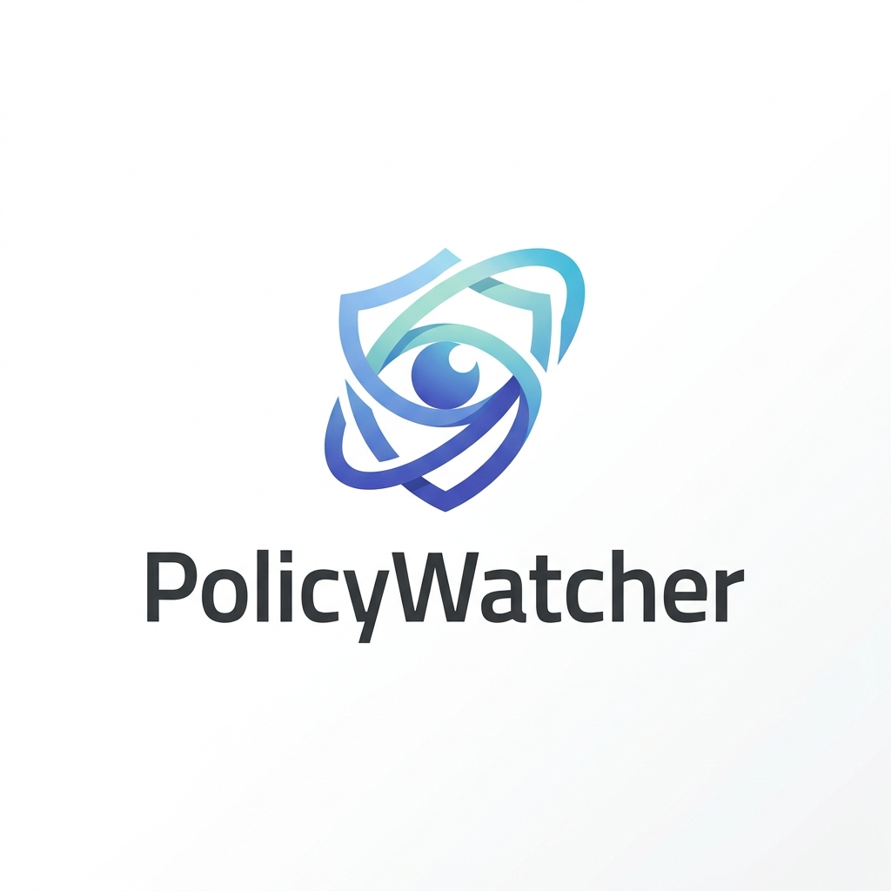
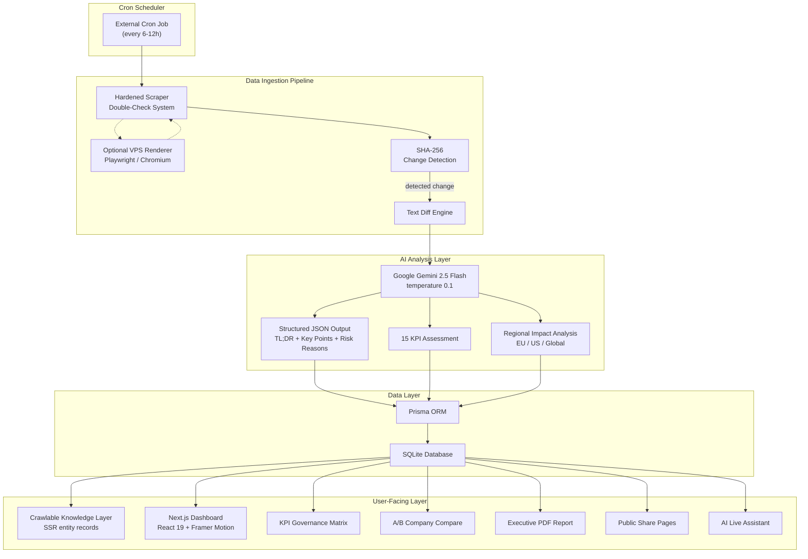
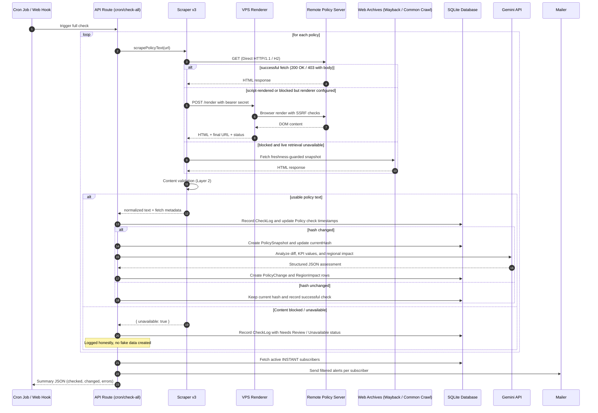
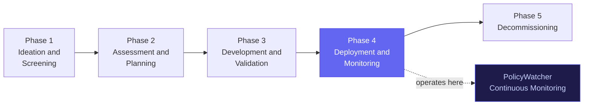
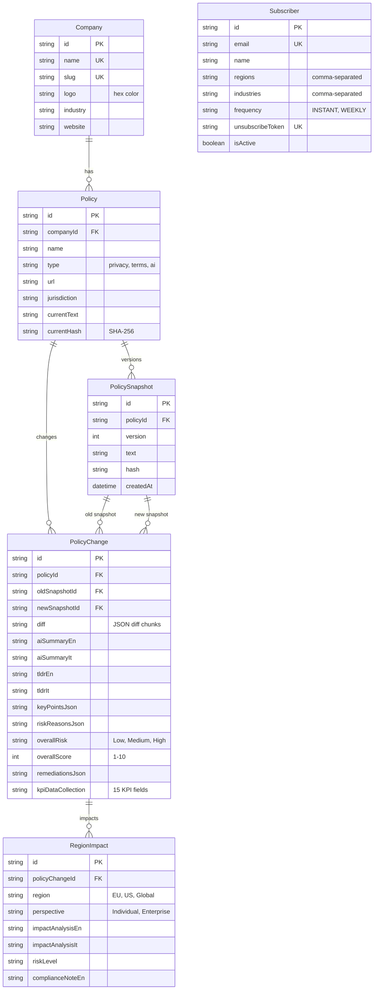

<p align="center">
  
</p>

<h1 align="center">PolicyWatcher</h1>

<p align="center">
  <strong>AI-assisted monitoring of configured public policy sources.</strong>
</p>

<p align="center">
  <a href="https://creativecommons.org/licenses/by/4.0/"></a>
  <a href="https://www.policywatcher.online"></a>
  <a href="https://github.com/sev7enITA/policywatcher/actions/workflows/quality.yml"></a>
  <a href="https://github.com/sev7enITA/policywatcher/actions/workflows/codeql.yml"></a>
  <a href="https://github.com/sev7enITA/policywatcher/actions/workflows/coverage.yml"></a>
  <a href="https://scorecard.dev/viewer/?uri=github.com/sev7enITA/policywatcher"></a>
  <a href="https://www.bestpractices.dev/projects/13465"></a>
  
  
  
  
  
  
</p>

<p align="center">
  <strong>Highlighted public evidence:</strong>
  OpenSSF Best Practices project <a href="https://www.bestpractices.dev/projects/13465">13465</a> provides a repository-process self-attestation status.
  GitHub Quality Gate, CodeQL, OpenSSF Scorecard, and Targeted Reliability Coverage badges expose public workflow/repository evidence.
  These are operational quality signals, not legal, regulatory, or security certifications.
</p>

---

## What Is PolicyWatcher?

PolicyWatcher monitors configured public policy sources for 16 technology and financial companies across six sectors. The count excludes the WAZE admin-onboarding fixture and is not exhaustive market coverage. It records retrieval evidence, detects text changes via SHA-256 hashing, and runs each detected change through Google Gemini for structured bilingual (EN/IT) risk analysis.

The platform is designed as a **civic tech tool** that produces structured summaries and governance indicators from retrieved public policy texts for review by citizens, SMEs, DPOs, and compliance professionals.

### Release 3.9.0 Beta 26 Crawlable Public Knowledge Layer Highlights

- **Server-rendered reference index:** `/knowledge` lists only public companies, policies, baselines and changes admitted by the shared evidence gates.
- **Canonical entity records:** company and policy pages expose source, jurisdiction, ingestion method, verification timestamps, published baseline metadata and linked evidence without reproducing raw policy text.
- **Crawlable home snapshot:** the public Knowledge summary and its entity links are present in the initial HTML and remain available without JavaScript.
- **Machine discovery:** `robots.txt`, `llms.txt` and the dynamic sitemap connect public pages and machine-readable endpoints while keeping protected and mutation routes outside crawler scope.
- **Visible structured data:** JSON-LD claims and citations correspond to visible page content and use safely escaped serialization.
- **Fail-closed publication state:** absent migrations, unavailable storage, empty scans and withheld records never become a positive or apparently healthy state.
- **Interactive boundary retained:** the Terms acknowledgement applies to the dashboard workspace below the public snapshot and does not cover or remove the crawlable reference layer.
- **Implementation guide:** [docs/crawlable-public-knowledge-layer.md](docs/crawlable-public-knowledge-layer.md) records routes, data boundaries, crawler behavior and validation requirements.

### Release 3.9.0 Beta 25 Admin Shell Readability Highlights

- **Explicit context:** the shared protected shell identifies the authenticated Admin or Auditor role and the current route.
- **Structural orientation:** active navigation uses a persistent marker in addition to colour.
- **Keyboard entry:** a skip link moves focus to a stable administrative main region.
- **Consistent controls:** shared navigation, menu, close and logout actions retain at least 44px targets and visible focus states.
- **Readable state:** verification and error panels use accessible semantics, while shared secondary text retains a 12px minimum.
- **Scope boundary:** this release changes the shared administrative frame only; authentication, authorization, protected-page behavior and API contracts are unchanged.

### Release 3.9.0 Beta 24 Webhook Operations UX Highlights

- **Exception-first focus:** the protected console derives one next review action from the returned configuration and delivery state.
- **Faster ledger inspection:** local views separate needs-action, scheduled and delivered records, with search across endpoint, event and change identifiers.
- **Explicit context:** result counts, reset controls and separate empty-outbox and no-match states keep filtering visible.
- **Role clarity:** administrators retain cycle and retry actions while auditors receive an explicit read-only presentation.
- **Mobile legibility:** supporting page text remains at least 12px, controls retain 44px targets and the ledger avoids page-level horizontal overflow.
- **Scope boundary:** this release changes UI hierarchy and local filtering only; delivery, authorization and retry behavior are unchanged.

### Release 3.9.0 Beta 23 Configured Webhook Delivery Pilot Highlights

- **Deployment-controlled destinations:** operators configure a bounded list of allowlisted HTTPS receivers and signing secrets outside the public application surface.
- **Signed delivery:** each eligible public change event uses the documented HMAC-SHA256 v1 headers, exact raw JSON bytes and stable event ID.
- **Persistent delivery evidence:** the outbox and attempt ledger record state, status code, bounded error code and timing without storing receiver response bodies.
- **Bounded retries:** retryable network and HTTP outcomes use a fixed six-attempt schedule; permanent client responses become terminal failures.
- **Protected operations:** administrators can run one bounded cycle and reschedule eligible failures; auditors have a sanitized read-only console.
- **Scope boundary:** this pilot has no public subscriptions, endpoint self-service, challenge verification, automatic key rotation, delivery guarantee or SLA.

### Release 3.9.0 Beta 22 Event Feed Continuity Highlights

- **Continuity workbench:** inspect a bounded current event window or explicitly resume from a browser-local opaque checkpoint.
- **Observable findings:** identify duplicates, ordering regressions, overlap, empty polls and initial-window truncation without treating the report as proof of exhaustive monitoring.
- **Portable checkpoint:** import or export a strict versioned JSON file containing only public event identifiers, the feed cursor and a bounded watermark.
- **Controlled requests:** explicit idle, loading, success and error states avoid automatic retry loops and preserve operator control.
- **Public contract:** the checkpoint JSON Schema, developer documentation, release impact and Press Kit state the polling and delivery boundaries together.

### Release 3.9.0 Beta 21 Source Reliability and Receiver Conformance Highlights

- **Reliable acquisition accounting:** one normalized retrieval can serve multiple policy comparisons while scan runs preserve selected-record, network-fetch and deduplication counts.
- **Exact public baselines:** a successful first retrieval establishes or promotes an exact-hash baseline without creating a change event, score or notification.
- **Structured remediation:** typed retrieval causes, repeated-failure state and historical source references remain separated from public evidence eligibility.
- **Protected operations:** the admin dashboard and Source Reliability console expose publication coverage, withheld records, retrieval keys, scan runs and remediation boundaries.
- **Receiver Conformance Lab:** eight deterministic positive and negative fixtures exercise every documented webhook verification decision code in the browser.
- **Deployment repair path:** dry-run-first baseline repair and a read-only inventory audit support existing Hostinger SQLite databases without bypassing the evidence gate.

### Release 3.9.0 Beta 20 Webhook Verification Readiness Highlights

- **Local verification workbench:** `/developers/webhook-readiness` verifies the candidate HMAC-SHA256 contract in the browser without submitting or persisting field values.
- **Versioned receiver kit:** `/api/v1/webhook-verification-kit` publishes exact header names, signing-input format, a deterministic public test vector and Node/Python examples.
- **Strict verification helpers:** malformed headers, empty secrets, invalid timestamps, stale messages and signature mismatches fail closed; server-side digest comparison uses a constant-time primitive.
- **Historical-vector boundary:** the static vector tests signature compatibility at its recorded timestamp and does not justify disabling freshness or replay protection in production.
- **Public contract discovery:** Developers, Integration Hub, API documentation, JSON Schemas, sitemap, Feature Atlas and the Community Roadmap expose the available readiness surface.
- **Delivery boundary:** endpoint registration, subscriptions, production secret provisioning, push delivery, retries, replay storage, key rotation and delivery receipts remain outside this release.

### Release 3.9.0 Beta 19 Collaboration Delivery Contracts Highlights

- **Vendor-neutral review handoff:** Evidence Collections now exports deterministic review work items through `format=handoff`, with evidence links, digests, review questions and acceptance criteria.
- **Public change-event polling:** `/api/v1/change-events` exposes already-published change events with bounded pages, localized summaries and an opaque forward cursor.
- **Publication-time ordering:** a dedicated publication timestamp keeps late approvals and republications visible after a consumer has advanced its cursor.
- **Versioned contracts:** public JSON Schemas describe both the Evidence Handoff and Change Event Feed payloads.
- **Explicit delivery boundary:** the release does not create third-party records or provide subscribers, recipients, push delivery, HMAC signing, retries or delivery receipts.
- **Deployment-ready migration:** existing public changes receive a publication-time backfill while private changes remain excluded.

### Release 3.9.0 Beta 18 Evidence Workflow Refinements Highlights

- **Consistent Collections hierarchy:** the evidence register now precedes the local ledger in visual, DOM and keyboard order across desktop and mobile layouts.
- **Faster mobile path:** a compact three-step ribbon and reciprocal register/ledger controls reduce repeated scrolling without changing the browser-local data boundary.
- **Progressive disclosure:** search, digest, share and export controls appear only when the current dataset or selection makes them actionable.
- **Evidence-first entry:** the Evidence Packet register appears before the provenance explainer and exposes direct actions for files and Collections.
- **Clearer developer sequence:** public API v1 endpoints precede the Enterprise v2 pilot, with explicit standard and collection rate limits.
- **Service-page consistency:** Developers and Integrations use the compact footer; programmatically focused collection regions retain a visible focus indicator.

### Release 3.9.0 Beta 17 Shareable Evidence Collections Highlights

- **Local evidence workspace:** `/collections` lets a reviewer select up to 12 exact published changes without creating an account or sending collaboration notes to the server.
- **Privacy-bounded sharing:** canonical share links contain only sorted public change UUIDs; the collection title and review status remain in local browser storage.
- **Deterministic bundles:** `/api/v1/evidence-collections` exports the complete selection as JSON, Markdown or CSV with a collection digest and each Evidence Packet digest.
- **Review-ready context:** exports preserve citations, source and score provenance, advisory governance references, review questions and interpretation boundaries.
- **Strict public contract:** invalid, missing or withheld records fail the entire request; the endpoint is allowlisted, rate-limited and registered in the public API v1 manifest.
- **Integration boundary:** the bundle is an available generic read surface. Persistent team workspaces and vendor-specific publishing remain planned; configured signed delivery is documented separately as a deployment-controlled Beta 23 pilot.

### Release 3.9.0 Beta 16 Evidence Governance Packets Highlights

- **Change-bound evidence packets:** `/evidence` and `/evidence/[changeId]` connect one public change to its source-confidence state, public snapshot fingerprints, score trace, governance review mappings and exact report downloads.
- **Correct historical reporting:** PDF and JSON packets are resolved by `changeId`; opening an older change no longer produces a report for a later policy analysis.
- **Source-anchored explainability:** new risk reasons can retain an exact source passage, snapshot side and related KPI. The passage is exposed only when it exactly matches the declared public snapshot.
- **Advisory governance mapping:** assessed KPI topics are mapped to review questions for the EU AI Act, ISO/IEC 42001, NIST AI RMF and OECD AI Principles without producing compliance verdicts.
- **Sanitized Dataset QA evidence:** public packets reuse source-continuity and publication-gate state while excluding raw failure reasons, private review notes and snapshot text.
- **Change-bound outputs:** each published packet provides deterministic JSON and a compact PDF with review questions, methodology boundaries and a content digest.
- **Public Pulse correction:** Product Hunt and Show HN launch operations no longer appear in public editorial content; the related workflow remains protected under Admin Outreach.

### Release 3.9.0 Beta 15 Citable Coverage Registry Highlights

- **One coverage contract:** `/press` is driven by a typed external-reference registry with stable IDs, source URLs, classification, language and month-level date precision.
- **Derived totals:** record, editorial-reference and professional-post counts come from the registry instead of separately maintained page values.
- **Reusable citations:** every record exposes a citation and makes descriptive registry titles distinguishable from publisher-supplied titles.
- **Machine-readable distributions:** `/api/press/coverage` provides bounded JSON and CSV representations with a public JSON Schema.
- **Structured discovery:** Dataset and ItemList metadata describe the registry and its original external sources.
- **Explicit boundary:** inclusion records a public reference and does not establish endorsement, certification, independent audit, readership, reach or factual validation.

### Release 3.9.0 Beta 14 Press Outreach Operations Highlights

- **Protected outreach desk:** `/admin/outreach` combines release checks, fixed campaign copy, privacy-minimized operation logging and aggregate editorial signals.
- **Role boundary:** administrators can record allowlisted operations; auditors can inspect definitions and aggregate counts without write access.
- **Fixed distribution cohorts:** Italian press, international press, LinkedIn, Product Hunt and Show HN reuse the reviewed Beta 13 evidence package without recipient-level records.
- **Bounded measurement:** reuse, drivers, outcomes and correction requests remain separate counts, without visitor joins, conversion rates or pre-baseline targets.
- **Security hardening:** adversarial payload tests cover content type, malformed JSON, oversized bodies and storage failures; operational email logs use masked recipient references.
- **Privacy clarification:** the public notice now describes the essential protected-session cookie and avoids an unsupported live-database encryption claim.

### Release 3.9.0 Beta 13 Editorial Pulse and Distribution Highlights

- **Verified editorial leads:** `/pulse` publishes a small human-approved registry with dated facts, proof links, explicit boundaries and reusable citations.
- **Versioned Story Packs:** each public lead provides a deterministic ZIP containing manifest, pitch, facts, sources and citation files.
- **Reusable distribution assets:** four social-card formats, specific Open Graph images and citation-bearing iframe visuals are available from each story page.
- **Machine-readable Data Room:** Dataset and DataDownload structured data describe the current public snapshot and its distributions.
- **Aggregate measurement:** allowlisted editorial events are counted without persistent visitor identifiers, referrers, query strings, IP addresses or raw user content.
- **Historical launch material:** Product Hunt and Show HN copy remains in the protected Admin Outreach workflow and is no longer displayed by the public Pulse page.

### Release 3.9.0 Beta 12 Local MIME Evidence Intake Highlights

- **Local `.eml` path:** the What Changed workflow can decode a saved email entirely in browser memory without mailbox access or raw-message upload.
- **Bounded MIME parser:** file size, nesting depth and part count fail closed; encoded headers, base64, quoted-printable and multipart alternatives are supported without a new runtime package.
- **Text-first extraction:** plain text is preferred, HTML is reduced to visible inactive text and cleaned HTTP(S) links, and active markup is discarded.
- **Attachment exclusion:** recipient headers and attachments never enter the extracted text or structured clues; attachment-only and unsupported messages are rejected.
- **Existing server boundary retained:** only confirmed organization/domain, cleaned URL, categories and dates can reach the inquiry API.

### Release 3.9.0 Beta 11 Evidence Delivery & Integration Highlights

- **Read-only integration directory:** `/api/v1/manifest` provides a machine-readable directory of public sources, allowed parameters, evidence gates, cache policy and rate policy.
- **Curated Observatory API:** `/api/v1/observatory?lang=en|it` provides localized source-registry, signal and event metadata together with the manual-review boundary; it is not an automated external news feed.
- **Public developer documentation:** `/developers` explains the available integration contract, browser-read CORS behavior, public-data limits and deferred webhook scope.
- **Bounded discovery:** Builder workspace quick actions, command palette, navigation ribbon, footer, Site Atlas, roadmap and sitemap point to the same public integration entry point.
- **Readable display hierarchy:** display font loading now uses a restrained 400/600/700 scale for less dense public headings and controls.

### Release 3.9.0 Beta 10 Source Continuity Ledger Highlights

- **Separate evidence records** divide the Timeline into provider policy changes and PolicyWatcher source-continuity events.
- **Sanitized transition ledger** derives meaningful suspension and recovery episodes from recorded check logs without exposing policy text, hashes, diffs, AI analysis, raw failure reasons or administrative records.
- **Qualified recovery semantics** label recovery only when an available check follows a withheld state and public snapshot evidence already exists.
- **Bounded public contract** limits policies and checks per response, reports truncation and applies the existing public rate limit and short cache policy.
- **Operational context** exposes standardized state, cause, retrieval channel, timestamp, source host and current-transition status with an explicit interpretation boundary.
- **Responsive inspection** adds keyboard-operable Timeline tabs, search, state filters, loading, error, empty and coverage states down to 375 px.

### Release 3.9.0 Beta 9 Verified Browser Distribution Highlights

- **Chrome availability verified** links the public Chrome Web Store listing directly from the browser-extension page.
- **Independent store states** report Chrome as published, Edge as having no verified Add-ons listing yet and Safari as not yet available.
- **No inherited status** removes the previous generic submission-planned label from the homepage, Browser Extension, Press Kit and supporting public copy.
- **Fail-closed links** keep install actions limited to validated HTTPS destinations on the expected official store host.
- **Distribution boundary** leaves the extension at 3.8.3 Beta 3 and changes only its documented availability and public installation route.

### Release 3.9.0 Beta 8 Assistant Consolidation Highlights

- **One persistent assistant trigger** removes the legacy floating blue chat button from the public dashboard.
- **Unified navigation retained** keeps the purple assistant action available on desktop and mobile.
- **Labelled discovery retained** keeps `AI Chat` inside Workspace Controls and the assistant action in the Command Palette.
- **Behavior unchanged** routes every retained entry point to the same Policy Live Assistant without changing generated answers or the chat API.
- **Regression coverage** verifies that the legacy trigger and its dedicated styles are absent while the unified actions remain wired.

### Release 3.9.0 Beta 7 Release Assurance Highlights

- **Mobile newsroom access** places compact Fast Facts directly after the hero, keeps all five newsroom actions in a keyboard-scrollable horizontal rail and adds a visible swipe cue on small screens.
- **Readable claim metadata** increases the visual separation and scanability of Claim Registry type, status, dates, cadence, proof, boundary and permalink fields.
- **Compact service footer** reduces footer dominance on Press Kit utility pages while retaining the complete footer elsewhere.
- **Privacy-minimized newsroom measurement** counts allowlisted package-download intentions, Data Room views and press-contact intentions through a cookie-free first-party endpoint.
- **Protected reporting** exposes all-time and trailing-30-day aggregate counts to authenticated admin and auditor roles with explicit zero and interpretation states.
- **Release hardening** keeps upstream chat errors and physical health-check paths out of public responses and requires explicit admin and auditor usernames in production.

#### Evidence Newsroom measurement definitions

- **Primary KPI:** press package download intentions, split by the EN or IT package target.
- **Drivers:** Data Room page views and press-contact intentions for press, fact-checking, interview or speaking routes.
- **Windows:** all-time and trailing 30-day aggregate event counts are visible to authenticated admin and auditor roles.
- **Guardrails:** failed event writes do not block a download, navigation or email action; event rows contain no persistent visitor identifier; counts do not represent unique people and can include automated traffic.
- **Baseline boundary:** no performance target or conversion rate is defined before sufficient baseline evidence exists.

### Release 3.9.0 Beta 6 Evidence Newsroom Highlights

- **Localized press packages** provide separate English and Italian ZIP downloads with dated fact sheets, owned media, data files, rights, manifests and SHA-256 checksums.
- **Versioned fact and claim records** add stable IDs, permalinks, `as of` dates, verification dates, review cadence, state and interpretation boundaries.
- **Newsroom archive and feeds** publish dated release records with `NewsArticle` metadata, RSS and JSON Feed endpoints.
- **Editorial data room** supplies a configured-scope snapshot in PNG, SVG, CSV and JSON with citation, date, method link and reuse boundary.
- **Asset metadata** embeds IPTC/XMP title, caption, creator, credit, rights, alt text and extended accessibility description in supplied PNG/JPEG files.
- **Provenance boundary** keeps Content Credentials explicitly unattached and records that no native vector master is currently supplied.
- **Specialized contact routes** prepare press, fact-checking, interview and speaking email requests without promising a response time.
- **Public reference registry** records corrections, clarifications, provenance status and a glossary without claiming exhaustive history before 27 July 2026.

### Release 3.9.0 Beta 5 Navigation Highlights

- **Press Kit navigation** adds `/press-kit` to Workspace Controls, the shared public header and Command Palette.
- **Visible dashboard access** places Press Kit in the Observe group immediately after Showcase.

- **Public claim language governance** replaces promotional absolutes and narrative comparisons with scoped descriptions of implemented behavior, dates, evidence boundaries and limitations.
- **Editorial regression coverage** checks selected public and distribution surfaces for unsupported security, freshness, explainability and product-quality phrases.
- **License terminology** describes PolicyWatcher as a civic-tech project with a public repository under CC BY 4.0, without implying an OSI license classification.

- **Press information page** adds a bilingual `/press-kit` with a Claim Ledger, scoped product facts, boilerplates, owned media downloads, checksum metadata, JSON-LD and a stable machine-readable JSON endpoint.
- **Media scope** distinguishes configured inventory from market coverage, source timestamps from release metadata, public mentions from endorsements, and checksum integrity from unattached Content Credentials.

### Protected Press Outreach Desk

- `/admin/outreach` turns the current public release assets into a fixed five-cohort operating registry for Italian press, international press, LinkedIn, Product Hunt and Show HN.
- The launch gate is an operator checklist stored only in browser local storage and versioned to the current release; it is not an automated availability, security or publication certification.
- Campaign links contain one allowlisted `campaign` value. Public landing records store only event type, campaign ID, locale and server timestamp.
- Administrators can record allowlisted aggregate pitch, reply, interview, coverage and correction events. Auditors have read-only access; the endpoint accepts no person, outlet, email, message, note or arbitrary target.
- The primary operating KPI is a count of Story Pack actions, citation copies and embed-code copies. Drivers and outcomes remain separate proxies, no percentages are produced and no performance target is assigned before a baseline exists.

- **Validated dashboard grammar** composes Citizen, GRC / Legal, Research and Builder workspaces from an immutable allowlisted registry with deterministic IDs and Source QA pinned.
- **One guarded interaction model** routes direct controls and the Command Palette through typed actions, an acyclic authorization graph and one canonical workspace URL/local-storage codec.
- **Evidence-first data loading** registers public dashboard sources with explicit endpoint, path/query allowlists, freshness, visibility, evidence-gate and limitation metadata; policy detail and company comparison no longer bypass the registry.
- **UI/export parity** builds one filtered dashboard view model for both rendering and CSV export; CSV exports include a machine-readable provenance manifest, including empty results.
- **Shareable evidence views** copy a canonical URL for committed public filters and workspace state, restore valid views through browser history, and exclude personal/private evidence and consent state.
- **Canonical KPI semantics** give all 15 KPI fields one bilingual vocabulary, normalization rule, field-specific concern order and explicit `Not assessed` state.
- **Trend provenance** distinguishes chronological observation sequence from the originating snapshot version and exposes provenance and limitations alongside the chart.
- **Five governed visualizations** route risk trend, risk profile, current risk score, regional assessment and KPI benchmark through static renderer/spec contracts with bilingual summaries, exact-value tables, provenance, limitations and reduced-motion behavior.
- **Regional and benchmark semantics** keep missing heatmap cells and unassessed KPIs distinct from low risk, join benchmark dimensions by stable KPI key and use the canonical field-specific concern catalog.
- **Coordinated evidence drill-down** commits heatmap region and audience atomically, opens a radar KPI inspector with original and normalized values, preserves missing and tie states, and provides exact-value fallbacks.
- **Production dependency review** updates PostCSS to 8.5.23 and records the point-in-time deployable dependency audit. The documented `brace-expansion` advisory is limited to upstream lint plugins. Dependency-audit results are operational evidence, not a security certification.
- **No Vizro runtime** retains the native Next.js, React, Recharts and Prisma stack; Vizro 0.1.59 was used only as a pinned architectural knowledge source.

### Release 3.8.3 Beta 4 Regional Retrieval Hardening Highlights

- **Visible-text sender recovery** identifies a brand domain from pasted notification text, filters common personal-email providers and still gives an explicit `From:` header priority.
- **Strict date recovery** accepts European numeric and ISO effective dates while rejecting impossible calendar dates instead of silently rolling them forward.
- **Regional source discovery** reads ccTLDs, locale URL segments, query parameters and hreflang alternates so valid EU, UK and US policy variants reach review.
- **Geographic fail-closed rules** avoid mapping `fr-CA`, `es-MX` or `pt-BR` to EU and preserve explicit uppercase EU, UK and US labels without treating “contact us” as a market.
- **Bounded verification** adds locale-aware probes and wider review caps without bypassing evidence checks or human approval.
- **Extension boundary preserved** keeps the browser extension at 3.8.3 Beta 3 and makes no change to its privacy model, permissions or store package.

### Release 3.8.3 Beta 3 Extension-First Evidence Highlights

- **Store-safe typography** removes literal em dashes from product, extension, test, documentation and tracked marketing surfaces and uses colon-separated extension titles.
- **Homepage Beta release channel** adds one compact, bilingual `v3.8.3-beta.3 · BETA` strip after Workspace Active with browser-specific distribution status, extension details and the mobile paste fallback.
- **Security closure** removes the two CodeQL failure triggers and the two template-syntax warnings with behavioral regressions.
- **Real integration evidence** runs the public inquiry handler against a temporary SQLite schema and rejects raw-content fields before persistence.
- **Real browser evidence** loads the packaged extension in Chromium, verifies the Manifest V3 service worker and walks disclosure, capture and review states.
- **Two-path intake** recommends the browser extension on desktop for local DOM-link capture and keeps plain-text paste as the primary mobile fallback.
- **No invented hidden links** states explicitly that copied text cannot reconstruct URLs behind buttons or words such as `here`; missing links fall back to monitored sources or minimized discovery and QA.
- **General-purpose extraction** uses neutral organization patterns and fixtures rather than product-specific UI examples or brand allowlists.
- **Context-bound extension scanning** prefers policy anchors inside the opened notification and fails closed for opaque or tokenized redirect links.
- **Verified store status** exposes a bilingual extension page whose install actions appear only for validated HTTPS store destinations; Chrome is published, while Edge listing verification and Safari signing/review remain explicit external dependencies.

### Release 3.8.2 Inquiry Handoff Reliability Highlights

- **Real-world signature recognition** extracts brands from signatures such as `Il Team MioDottore` and rejects greetings such as `Gentile utente` as company names.
- **Italian AI-category recognition** identifies contextual `IA` language without reintroducing false positives from the Italian preposition `ai`.
- **Unbypassable npm startup gate** routes `npm start` through `server.js`, which verifies and upgrades the configured SQLite schema before Next.js accepts traffic.
- **Transient-write recovery** retries bounded SQLite lock/time-out contention before returning an unavailable receipt that does not claim persistence.

### Release 3.8.1 Mobile Inquiry Reliability Highlights

- **One-action mobile intake** turns a pasted notice into a local company/category summary and a single `Check what changed` action; correction fields stay collapsed unless needed.
- **Persistence receipts** separate persisted success from failed storage: only a successful database write receives a reference and appears in `Admin → Policy inquiries`.
- **Operator visibility** adds an open-inquiry counter to the admin navigation and an optional privacy-minimized SMTP alert through `ADMIN_ALERT_EMAIL`.
- **Realistic company extraction** recognizes body/signature patterns such as BlaBlaCar without treating section headings as organization names.
- **Progressive explainability** keeps the privacy boundary, portfolio-wide scope and human QA gate available without forcing a long scroll before verification.

### Release 3.8.0 Browser Evidence Companion Highlights

- **One-click local inspection** lets a person invoke PolicyWatcher on an opened policy-update notice without granting persistent access to Gmail, Outlook or browsing history.
- **Minimum-permission architecture** uses Manifest V3 `activeTab` and `scripting` only after an explicit gesture, plus a host permission limited to `https://www.policywatcher.online/*`.
- **Raw-content boundary** extracts structured clues inside the active page and immediately discards the visible notice text; the service worker can transmit only the API allowlist fields.
- **Portfolio-wide evidence** confirms the organization, starting policy categories and dates before checking the company’s configured published evidence portfolio.
- **Cross-browser release** shares one dependency-free codebase across Chrome and Edge and includes the source and instructions required for Apple’s Safari Web Extension packager.

### Release 3.7.2 Calm Workspace Highlights

- **Progressive first-use onboarding** asks for objective and evidence depth, previews the resulting evidence modules, and keeps Source QA visible before the workspace is applied.
- **Workspace-aware toolbar** limits the primary surface to three relevant quick actions while retaining additional commands inside More.
- **Direct release transparency** turns the PolicyWatcher identity and version into an accessible changelog control and places the icon-only What Changed entry immediately before Search.
- **Focused mobile navigation** exposes What Changed, Workspace, AI Chat, Search and More with safe-area spacing and no document-level horizontal overflow.
- **Local personalization boundary** stores workspace preferences and onboarding completion in the browser; URL presets remain reversible and can bypass first-use setup without collecting user identity.

### Release 3.7.1 Evidence Intake Reliability Highlights

- **Plain-text-first intake** treats pasted notification text as a browser-local signal when copy-and-paste omits hidden links.
- **Explicit clue confirmation** lets the person review the organization, policy categories, dates, sender domain and an optional starting-policy URL before submission.
- **Portfolio-wide verification** prioritizes the policy categories named in the notice without excluding the company’s other public monitored policies.
- **Conflict and runtime explainability** stops mismatched organization/domain clues and distinguishes missing or unavailable database storage from an ordinary verification failure.
- **Privacy boundary retained** sends only confirmed structured clues; the raw email, subject, recipient and message body never cross the browser boundary.

### Release 3.7.0 Evidence Experience Highlights

- **Notification-to-evidence desk** at `/what-changed` interprets a pasted notice locally in the browser and returns only public, source-gated evidence or a privacy-minimized review reference.
- **One-request company onboarding** creates the company and claims its persistent discovery job server-side; the browser no longer has to coordinate two dependent writes.
- **Baseline in context** lets an administrator approve discovered sources and run the targeted first baseline without leaving Company Manager. The handoff to normal monitoring occurs only after every approved policy has verified evidence.
- **Evidence-aware KPI QA** combines assessed values from the latest public change of each company policy, shows the originating policy/date, reports coverage, and distinguishes `Pending` from a numerical risk score.
- **Self-checking Hostinger startup** applies the idempotent runtime schema initializer for both npm and direct bridge startup, with Node/Python fallback parity protected by tests.
- **Human inquiry gate** at `/admin/inquiries` lets administrators link a known company, approve a new canonical company into persistent discovery, reject/mark duplicates, or resolve the request to an existing public change. Every transition is written to the review log.
- **Release hardening** enforces atomic active-ticket deduplication, validates complete fallback schemas before migration reconciliation, and refuses mutable CLI downloads during production startup.

#### Policy inquiry privacy and evidence contract

- Maximum local input is 20 KB. Notification parsing happens in the browser; the raw text is never included in the API request.
- The server receives only an organization/domain clue, a query-free official URL when present, policy categories and notification/effective dates. It stores no email address, subject, message body, redacted excerpt or content fingerprint.
- User-submitted URLs are clues only and are not fetched until an administrator approves onboarding.
- Pasted notifications are never sent to Gemini. Verified answers come only from `publicPolicyWhere` / `publicChangeWhere` records.
- A first scan establishes a baseline and cannot, by itself, prove what changed before monitoring began.
- Production must set `TRUSTED_CLIENT_IP_HEADER` to a provider-controlled client-IP header, or enable `TRUST_PROXY_HEADERS=true` only after confirming that the Hostinger proxy overwrites forwarded headers. Otherwise the low-volume inquiry limiter falls back to one shared `unknown` bucket.

### Release 3.6.4 Audit Fixes Highlights

- **Durable discovery jobs** persist run state in SQLite and use atomic claims so polling survives process boundaries and prevents overlapping work.
- **Onboarding reconciliation** keeps batch status synchronized when publication QA fails and safely reuses or audit-reopens existing discovery candidates.
- **Input and UI correctness** returns controlled errors for malformed discovery requests, removes continuous device-motion work, and uses UTC calendar days for Observatory countdowns.
- **Regression coverage** covers the six recorded GitHub audit findings before the Hostinger production rollout.

### Release 3.6.3 Guided Evidence Workflows Highlights

- **Objective-based dashboard composer** now becomes the first-use start screen: it asks for the user objective and evidence depth, then previews and applies a stack assembled from registered, real dashboard evidence modules.
- **Bulk source onboarding** at `/admin/source-onboarding` adds a durable five-stage intake: proposed source, official-source review, first private baseline, QA gate, and explicit publish/hold/reject decision.
- **Publication safety** keeps imported candidates and their first baselines private. Passing QA is necessary but not sufficient: only an explicit admin publication decision can cross the public-evidence boundary.
- **Source remediation hardening** for official-but-blocked providers: market-specific Revolut EU/UK source mappings, explicit provider-challenge suspension wording, and documented PDF/manual-review fallback paths.
- **Public suspension explainability** now distinguishes anti-bot/provider challenge, insufficient policy text, stale archive evidence, missing source baseline, and partial retrieval.
- **Press Wall expansion** with local visual previews for tracked public references, including Giovanna Panucci / Gladiatori Digitali.

### Release 3.6.1 Adaptive Workspace Foundation Highlights

- **Adaptive Workspace foundation** introduced the intent/depth profile, persistence, and deep-link model that the 3.6.3 first-use composer now uses to assemble real evidence modules.
- **Intent profiles** for Citizen, GRC / Legal, Research, and Builder sessions adjust density, module priority, visual accent, and operational context.
- **Evidence-depth profiles** for Snapshot, Operational, and Forensic views determine how much retrieval, QA, review, and methodology context is surfaced.
- **Deep-link presets** such as `/?intent=citizen&depth=forensic` allow public pages and roadmap proposals to open the dashboard in a preconfigured workspace.
- **Safety invariant**: source suspensions, source-quality states, and data limitation notices remain visible across profiles.

### Release 3.6.0 Community Surface Highlights

- **Community Roadmap** (`/roadmap`) redesigned as an interactive signal board where users can choose their objective, preferred evidence depth, and roadmap priorities.
- **Press Wall** (`/press`) collecting articles, LinkedIn discussions, and public references about PolicyWatcher while keeping a clear non-certification boundary.
- **Press Kit** (`/press-kit`) providing facts, claims, owned assets, citation guidance and machine-readable newsroom metadata while keeping external coverage on the separate Press Wall.
- **Editorial Pulse** (`/pulse`) providing human-approved, evidence-linked story leads, deterministic Story Packs, reusable citations and embeddable evidence visuals.
- **Compact brand mark** adopted across public/admin headers to avoid duplicated wordmarks and improve visual balance.
- **Public resource navigation** expanded through footer and command palette instead of adding more toolbar complexity.
- **Showcase refresh** aligned with the current platform surface: public views, Dataset QA, Trust evidence, admin controls, community roadmap, and press coverage.

### Release 3.5.1 Audit Operations Highlights

- **Append-only review log** for human admin/auditor decisions in the Dataset QA workflow.
- **Persistent Dataset QA issue decisions** with `open`, `reviewed`, and `ignored` states.
- **Ignore-with-reason workflow** so ambiguity is documented instead of silently hidden.
- **CSV exports** for Dataset QA issue handoff and review-log evidence.
- **Roadmap status labels** separating implemented controls, active 3.5.1 work, and planned future capabilities.
- **Admin VPS Services monitor** for renderer reachability, configuration gates, public health telemetry, and controlled render smoke tests.
- **VPS Operations Agent** for optional admin-controlled renderer health, fixed smoke checks, backups, checksum-verified local package updates, rollback and capped operation logs.
- **Renderer-backed scraper hardening** via an optional VPS Playwright service for script-rendered policy pages, protected by bearer auth and SSRF validation.
- **Archive freshness guard** so Wayback/Common Crawl snapshots older than the last successful check cannot be mistaken for a current policy change.
- **Source-fit URL migration** with `--dry-run`, company/policy/jurisdiction scoping, and corrected Wise/Meta source handling.
- **Dashboard confidence UX calibration** with the use-boundary acknowledgement moved out of the first impression and local dashboard density/view/accent controls.

### Release 3.5 Highlights

- **Adaptive Fallback Scraper Cascade (5 levels)**: attempts direct HTTP/1.1, explicit HTTP/2, optional rendered fetch through the hardened VPS renderer, then freshness-guarded Wayback Machine and Common Crawl recovery.
- **Polite Crawling & Delays**: Random 1-3s delays between policy fetches to avoid rate limit bans.
- **KPI Preservation**: Automatic inheritance of the 15-KPI governance metrics on new scans, preventing database records from resetting to "Not assessed".
- **Data Integrity Repair Script**: `/scripts/repair-data.ts` to recompute SHA-256 hashes, backfill missing AI summaries (TL;DR, keyPointsJson), and restore broken KPI cells in the database.
- Public policy-change timeline with stable `/change/[id]` permalinks.
- Home-page Market Pulse timeline showing recent policy movements by sector.
- Public Policy Signals Board (`/leaderboard`) ranking evidence availability, retrieval traceability, source coverage, and publicEvidence-gated movement without certifying companies or compliance.
- Embeddable `/embed/change/[id]` widgets for third-party pages.
- Dynamic Open Graph image generation and sitemap support for better sharing and indexing.
- Rich diff rendering for policy additions, removals, and unchanged context.
- Industry benchmark option in the A/B radar comparison.
- Admin encrypted backup export and verification workflow.
- Admin Dataset QA dashboard and issue queue for source-fit, integrity, freshness, KPI coverage, regional-impact coverage, subscriber hygiene checks, reviewed decisions, ignored reasons, and reopen actions.
- Public Trust & Quality Evidence page (`/trust`) with CI, CodeQL, OpenSSF Scorecard, targeted reliability coverage, live-header report links, and dataset assurance boundaries.
- Pre-release security hardening for secrets, rate limits, AI output rendering, email templates, subscriber tokens, scraper egress, deployment diagnostics, and backup passphrases.
- Dedicated deployment guidance for the Hostinger app package and the separate VPS renderer service.

### Key Value Propositions

- **Automated monitoring workflow** for 16 configured monitored companies across 6 industry sectors, excluding the WAZE admin-onboarding fixture, with public records gated until source evidence is available.
- **Transparent AI scoring** where generated risk scores are retained only when backed by retrieved policy text and structured model output.
- **15-KPI governance matrix** covering Privacy, AI Governance, and Ethics. Static bilingual KPI notes are disabled in public mode unless explicitly enabled after editorial review.
- **Regional impact analysis** across EU, US, and Global jurisdictions from both Individual and Enterprise perspectives.
- **Bilingual support** for selected public workflows, guidance and structured AI-output fields in English and Italian.

---

## Monitored Companies

| Sector | Companies |
|--------|-----------|
| **Tech Giants** | Google, Microsoft, Apple, Amazon, Meta |
| **FinTech** | Stripe, PayPal, Revolut, Wise, Klarna, Plaid |
| **AI Providers** | OpenAI, Anthropic |
| **Social Media** | TikTok |
| **Cloud/SaaS** | Salesforce |
| **E-Commerce** | Shopify |

Each company is tracked across multiple policy types: Privacy Policy, Terms of Service, AI Terms, and Acceptable Use Policy where applicable.

---

## Architecture

### System Overview


```mermaid
flowchart TB
    subgraph Scheduling["Cron Scheduler"]
        CRON["External Cron Job<br/>(every 6-12h)"]
    end

    subgraph Ingestion["Data Ingestion Pipeline"]
        SCRAPER["Hardened Scraper<br/>Double-Check System"]
        RENDERER["Optional VPS Renderer<br/>Playwright / Chromium"]
        HASH["SHA-256<br/>Change Detection"]
        DIFF["Text Diff Engine"]
    end

    subgraph AI["AI Analysis Layer"]
        GEMINI["Google Gemini 2.5 Flash<br/>temperature 0.1"]
        STRUCT["Structured JSON Output<br/>TL;DR + Key Points + Risk Reasons"]
        KPI["15 KPI Assessment"]
        REGION["Regional Impact Analysis<br/>EU / US / Global"]
    end

    subgraph Storage["Data Layer"]
        PRISMA["Prisma ORM"]
        SQLITE["SQLite Database"]
    end

    subgraph Delivery["User-Facing Layer"]
        KNOWLEDGE["Crawlable Knowledge Layer<br/>SSR entity records"]
        DASH["Next.js Dashboard<br/>React 19 + Framer Motion"]
        MATRIX["KPI Governance Matrix"]
        COMPARE["A/B Company Compare"]
        PDF["Executive PDF Report"]
        SHARE["Public Share Pages"]
        CHAT["AI Live Assistant"]
    end

    CRON --> SCRAPER
    SCRAPER -.-> RENDERER
    RENDERER -.-> SCRAPER
    SCRAPER --> HASH
    HASH -->|detected change| DIFF
    DIFF --> GEMINI
    GEMINI --> STRUCT & KPI & REGION
    STRUCT & KPI & REGION --> PRISMA
    PRISMA --> SQLITE
    SQLITE --> KNOWLEDGE & DASH & MATRIX & COMPARE & PDF & SHARE & CHAT
```

### Ingestion Pipeline Sequence


```mermaid
sequenceDiagram
    autonumber
    participant Cron as Cron Job / Web Hook
    participant API as API Route (cron/check-all)
    participant Scraper as Scraper v3
    participant Renderer as VPS Renderer
    participant Policy as Remote Policy Server
    participant Archive as Web Archives (Wayback / Common Crawl)
    participant DB as SQLite Database
    participant Gemini as Gemini API
    participant Mailer as Mailer

    Cron->>API: trigger full check
    loop for each policy
        API->>Scraper: scrapePolicyText(url)
        Scraper->>Policy: GET (Direct HTTP/1.1 / H2)
        alt successful fetch (200 OK / 403 with body)
            Policy-->>Scraper: HTML response
        else script-rendered or blocked but renderer configured
            Scraper->>Renderer: POST /render with bearer secret
            Renderer->>Policy: Browser render with SSRF checks
            Policy-->>Renderer: DOM content
            Renderer-->>Scraper: HTML + final URL + status
        else blocked and live retrieval unavailable
            Scraper->>Archive: Fetch freshness-guarded snapshot
            Archive-->>Scraper: HTML response
        end
        Scraper->>Scraper: Content validation (Layer 2)
        alt usable policy text
            Scraper-->>API: normalized text + fetch metadata
            API->>DB: Record CheckLog and update Policy check timestamps
            alt hash changed
                API->>DB: Create PolicySnapshot and update currentHash
                API->>Gemini: Analyze diff, KPI values, and regional impact
                Gemini-->>API: Structured JSON assessment
                API->>DB: Create PolicyChange and RegionImpact rows
            else hash unchanged
                API->>DB: Keep current hash and record successful check
            end
        else Content blocked / unavailable
            Scraper-->>API: { unavailable: true }
            API->>DB: Record CheckLog with Needs Review / Unavailable status
            Note over API: Logged honestly, no fake data created
        end
    end
    API->>DB: Fetch active INSTANT subscribers
    API->>Mailer: Send filtered alerts per subscriber
    API-->>Cron: Summary JSON (checked, changed, errors)
```

---

## Methodology

### Risk Score (1-10)

Each analyzed policy can receive a composite screening score from 1 to 10. Gemini 2.5 Flash is configured with temperature 0.1 to reduce output variation. Model output can be incomplete or incorrect and is not a legal or compliance determination.

| Range | Label | Criteria |
|-------|-------|----------|
| 1-3 | Low | Strong user protections, transparent AI practices, explicit consent, quick breach notification, published audit results |
| 4-6 | Medium | Partial protections, some opaque AI practices, opt-out consent flows, moderate data retention |
| 7-10 | High | Extensive data collection, opaque AI training, indefinite retention, broad third-party sharing, no independent audits |

The model is prompted to return three **Risk Reasons** with delta contributions (for example `+2` or `-1`). The application validates the structured response, but the reasons remain AI-assisted interpretations of the retrieved text.

### The 15 KPIs

Companies are evaluated across 15 Key Performance Indicators organized in three groups:

#### Privacy and Data Protection

| KPI | Green | Yellow | Red |
|-----|-------|--------|-----|
| Data Collection Scope | Minimal | Moderate | Extensive |
| Third-Party Sharing | None / Restricted | Limited / Controlled | Broad / Undisclosed |
| Data Retention | Limited (defined) | Extended | Indefinite |
| Right to Deletion | Full / Available | Partial | Not available |
| Cross-Border Transfer | Restricted | Controlled | Unrestricted |

#### AI Governance

| KPI | Green | Yellow | Red |
|-----|-------|--------|-----|
| AI Training Opt-Out | Available / Not used | Opt-out available | Not available |
| AI Output Ownership | User retained | Shared | Company retained |
| Algorithmic Transparency | Published / Disclosed | Mentioned / Partial | Opaque / Undisclosed |
| Automated Decisions | Transparent / Human-in-loop | Partial disclosure | Opaque / No review |
| AI Bias and Fairness | Committed / Certified | Mentioned | Absent |

#### Ethics and Corporate Governance

| KPI | Green | Yellow | Red |
|-----|-------|--------|-----|
| Consent Mechanism | Explicit opt-in | Opt-out | Implicit / Bundled |
| Regulatory Compliance | Comprehensive | Partial | Minimal |
| Breach Notification | Within 24h | Within 72h | Unspecified |
| Independent Audit | Certified / Published | Mentioned | Absent / Undisclosed |
| Content Moderation | Transparent | Partial | Opaque |

The KPI matrix includes **480 bilingual methodology notes** (16 companies x 15 KPIs x 2 languages). They support review consistency, do not replace current provider-source evidence, and remain disabled in public UI unless `NEXT_PUBLIC_ALLOW_STATIC_KPI_JUSTIFICATIONS=true` is set explicitly.

### Source Selection and Dataset QA

Dataset quality is treated as a release-control discipline. PolicyWatcher follows this source hierarchy:

- **Global first:** Global analysis should use the canonical English/global source when the company publishes one.
- **Market-specific when available:** EU, US, UK, or other regional analysis should point to the provider source for that market.
- **Localized pages are not primary evidence by default:** translated URLs such as `/it/` are flagged unless they are the only official market source and the jurisdiction label makes that clear.
- **Source provenance:** monitored policy records include the configured source URL, hash, check history, version metadata, and detected changes.
- **Public evidence gate:** snapshots and changes must be marked `publicEvidence` before they can feed public APIs, sitemap, digests, share pages, reports, timelines, the Policy Signals Board, or benchmarks.
- **Partial retrieval handling:** incomplete, truncated, or anomalous retrievals are marked `Partial` and suspended from public evidence instead of becoming accepted baselines.
- **Segmented legal hubs:** when a provider publishes several policies in one official legal hub, PolicyWatcher can monitor an anchor-scoped section such as `#end-user-privacy-policy` instead of accepting the whole hub as one mixed evidence body.
- **Provider-challenge remediation:** if an official source is protected by anti-bot or WAF controls, the VPS renderer is attempted but is not treated as a guarantee. Challenge pages, placeholders, stale archives, and too-short bodies stay suspended. Remediation must use a market-specific official URL, official PDF/CDN evidence where available, or a traced admin review before public exposure.

The admin **Dataset QA** gate checks URL hygiene, source-fit, hash integrity, freshness, structured AI JSON, KPI coverage, regional-impact coverage, archive timestamp evidence, public-evidence state, and subscriber hygiene. Critical findings are release blockers; warnings mark ambiguity or drift that should be resolved before public promotion. In 3.5.1, issue decisions can be marked reviewed, ignored with reason, or reopened; every decision writes an append-only admin review-log event.

Public QA rule: when the latest fetching/update cycle produces anomalies, seed-only evidence, partial retrieval, or a `Needs Review` / `Unavailable` status, PolicyWatcher suspends the source from public data views. The public UI may show a suspension notice and minimal metadata, but it does not expose the policy text, risk score, timeline event, KPI value, or AI interpretation until the source is verified again.

Policy Signals Board rule: `/leaderboard` is an evidence-only ranking surface. It orders companies by source coverage, retrieval traceability, public baselines, recency, suspension pressure, and publicEvidence-gated movement. It does not rank legal compliance, internal conduct, safety, or provider trustworthiness. Suspended sources reduce the operational evidence index and are listed in a source-attention queue instead of feeding public analysis.

Re-baseline rule: the first successful fetch after a record backed by `Seeded` ingestion evidence is treated as baseline establishment, not as a policy change. The system replaces the seeded history for that policy, stores one verified public-evidence baseline snapshot, updates hash/status/check-log evidence, and does not create a `PolicyChange`, run AI scoring, or notify subscribers. A `Configured` status alone is not enough to trigger destructive re-baseline; the operation also aborts if real source evidence, public snapshots, or reviewed history already exist.

Bulk-onboarding private-baseline rule: approving an official source creates controlled company/policy inventory and enables a targeted first-baseline scan, but neither import nor baseline capture publishes it. The item advances through persisted QA evidence and must reach `Ready`; an administrator must then explicitly choose publish, hold, or reject. Only publish promotes the baseline across the public-evidence gate.

Initial archive baseline rule: during the first `Seeded` re-baseline, the database bootstrap timestamp is not treated as a real successful source check. This means Wayback/Common Crawl evidence can be used when live direct/HTTP2/renderer retrieval is blocked, while the accepted record still carries `source=wayback` or `source=commoncrawl` plus `archiveTimestamp` for Dataset QA review.

Partial capture rule: if a strategy retrieves policy-like text but the extractor reaches the storage cap or otherwise marks the result incomplete, PolicyWatcher records the strategy as `partial` and suspends the source pending review. It is not counted as an accepted trusted baseline. Short placeholder legal pages are also rejected as insufficient evidence, even when they return HTTP 200.

Operational alert rule: source suspensions created by a manual scrape or by the scheduled check-all pipeline can trigger an internal administrator email. The email contains source metadata, status, reason, transport source, HTTP status, timestamp, and the Dataset QA console link; it excludes policy text, scores, diffs, KPIs, and AI interpretation.

Initial regeneration rule: on shared hosting, run the first real-source scan in batches. The admin Cron Manager and `/api/cron/check-all` accept `limit` and `companySlug` controls so long renderer/archive cycles can be resumed safely without one oversized HTTP request. Limited batches are ordered by oldest `lastCheckDate`, so repeated `limit=5` runs process the next least-recently checked records instead of restarting from the same first five.

Targeted update rule: to remediate a specific company, set `companySlug` in Cron Manager or call the cron endpoint with `companySlug=zoom`, `microsoft`, `plaid`, `amazon`, `klarna`, or any other company slug. This limits the scan to that company's configured policies while keeping the same source-evidence gates.

Host/path-drift rule: live retrieval paths (`direct`, `http2`, `rendered`) reject cross-host redirects and same-host policy URLs that land on a homepage before baseline or change creation. A configured URL that drifts away from the policy document is marked for review instead of being accepted as public evidence. Archive paths are identified separately and are not treated as live host continuity.

Extractor stability rule: the policy text normalizer avoids generic container wrappers and overlapping `div`/`span` extraction so the stored hash is based on stable policy text rather than duplicated layout text.

KPI freshness rule: newly detected policy changes do not inherit the 15 KPI fields from older changes. Until the KPI extraction schema is explicitly regenerated from the current source evidence, new change records store those KPI fields as `Not assessed`. This prevents stale KPI values from being presented as current evidence.

Admin KPI QA aggregation rule: the audit matrix does not treat one policy document as the complete company assessment. Each KPI cell uses a supported value from the latest public change of each monitored policy and retains the contributing policy and assessment date as provenance. It never reaches back to an older change when the latest assessment is pending. The displayed risk score remains the latest analyzed change score; companies without an analyzed public change are shown as `Pending`, never `0`.

Source remediation status: release 3.5.1 updated current official source mappings for Zoom Trust Center, Microsoft Privacy Statement final URLs, Plaid anchor-scoped legal sections, AWS DPA focused documentation, and Klarna US/EU sources. Release 3.6.3 adds market-specific Revolut EU/UK mappings and keeps Revolut sources suspended when provider anti-bot protection prevents evidence-grade retrieval. Klarna EU Terms remains a deliberate suspension candidate when the official English EU/Ireland terms page returns only a short placeholder body.

### Trust and Quality Evidence

PolicyWatcher exposes quality evidence in the application and in the public repository. These checks are operational controls, not legal, regulatory, or compliance certifications.

- `npm run qa:dataset` validates the local dataset at policy-record grain: accepted status values, SHA-256 consistency, version-record coverage, check-log presence, latest status alignment, and scan timestamps.
- `.github/workflows/quality.yml` runs Prisma validation, CI database seeding, dataset assurance, lint, production build, and a high-severity production-dependency audit.
- `.github/workflows/codeql.yml` runs GitHub CodeQL security-and-quality analysis for JavaScript and TypeScript.
- `.github/workflows/scorecard.yml` runs OpenSSF Scorecard and publishes public supply-chain posture results.
- OpenSSF Best Practices project `13465` is passing and exposed as public open-source process evidence.
- `.github/workflows/coverage.yml` runs targeted Vitest reliability coverage for auth/session, rate limiting, confidence metadata, diff parsing, subscriber preferences, and export/report utilities, then uploads to Codecov when `CODECOV_TOKEN` is configured.
- `.github/workflows/sonar.yml` is ready for SonarQube Cloud and activates when `SONAR_TOKEN` is configured.
- `SECURITY.md`, `CONTRIBUTING.md`, and `CODE_OF_CONDUCT.md` support the OpenSSF Best Practices self-attestation.
- `docs/platform-state-of-art-2026-07-05.md` and `docs/platform-state-of-art-2026-07-05.it.md` record the current platform state, renderer hardening, dataset profile, assurance controls, known warnings, deployment notes, and priorities.
- `docs/third-party-validation.md` records the exact setup steps and public report URLs for GitHub, OpenSSF, Sonar, Codecov, MDN Observatory, and SecurityHeaders.com.
- `/trust` explains what each badge/report means and states the non-certification boundary.
- Admin access logs minimize IP addresses before persistence and are cleaned up after 90 days by digest cron routes.

### Scraper Integrity (Double-Check System)

The scraper follows a strict "never fabricate" design:

**Layer 1 (Transport):**
- 20-second fetch timeout with 3 retry attempts and exponential backoff.
- User-Agent rotation across 3 browser profiles.
- DNS resolution before outbound fetches, private/internal IP rejection, and socket-pinned HTTP/1.1/HTTP/2 requests to reduce DNS rebinding risk.
- Redirect following with Public Suffix List based host-coherence checks and final-URL validation.
- Direct HTTP/1.1 first, explicit HTTP/2 fallback for providers that reject HTTP/1.1.
- HTTP/2 timeout and error paths close the underlying session and return fixed diagnostic tokens instead of raw network exception messages.

**Layer 2 (Content Validation):**
- Detects Cloudflare challenges, CAPTCHAs, maintenance pages, paywalls, and consent walls.
- Soft-404 detection for pages that return 200 but contain error content.
- Minimum text length enforcement (800 characters).
- Maximum text cap (500K characters).

**Live and archive fallback:**
- Optional VPS renderer (`renderer/`) runs Playwright/Chromium outside Hostinger for script-rendered policy pages.
- Renderer requires `RENDERER_SECRET`, validates initial URLs, final browser redirects, and subresource requests against SSRF rules, and refuses to start without a secret.
- Renderer validation is a browser request-boundary control; app-side HTTP/1.1 and HTTP/2 retrievals use stronger socket pinning because Node controls those sockets directly.
- Archive recovery uses Wayback Machine and Common Crawl only when snapshots are fresh enough relative to the policy's last successful check.
- Common Crawl WARC records are decompressed before HTML extraction, avoiding binary/gzip artifacts in text comparisons.
- Admin Cron Manager records the ordered retrieval strategy chain for each policy: direct, HTTP/2, renderer, Wayback, and Common Crawl each report accepted, rejected, failed, or skipped status plus the reason for escalating to the next fallback.

**Result types:**
- `ok` - valid policy text, stored with SHA-256 hash.
- `unavailable` - temporary issue, flagged honestly with a "visit the official site" message.
- `invalid` - permanently dead link (404/410).

### PALO Framework Integration

PolicyWatcher's methodology is aligned with the **PALO Framework** (Principled AI Lifecycle Orchestration), developed by Fabrizio Degni. PALO synthesizes ISO 42001, the EU AI Act, OECD AI Principles, and NIST AI RMF into a unified operational lifecycle.

PolicyWatcher operates as a continuous **Deployment and Monitoring** tool (Phase 4) while its KPI framework draws from the Ethical KPIs paradigm that PALO advocates: converting abstract ethical principles into measurable, comparable metrics.


```mermaid
flowchart LR
    P1["Phase 1<br/>Ideation and<br/>Screening"]
    P2["Phase 2<br/>Assessment and<br/>Planning"]
    P3["Phase 3<br/>Development and<br/>Validation"]
    P4["Phase 4<br/>Deployment and<br/>Monitoring"]
    P5["Phase 5<br/>Decommissioning"]

    P1 --> P2 --> P3 --> P4 --> P5

    PW["PolicyWatcher<br/>Continuous Monitoring"]

    P4 -.->|"operates here"| PW

    style P4 fill:#6366f1,stroke:#4f46e5,color:#fff
    style PW fill:#1e1b4b,stroke:#6366f1,color:#c7d2fe
```

---

## Features

### Dashboard
- First-use Objective-based Dashboard Composer with goal profiles for Citizen, GRC / Legal, Research, and Builder sessions.
- Evidence-depth selector for Snapshot, Operational, and Forensic views.
- Generated previews contain only registered dashboard evidence modules; Source QA is pinned in every composition.
- Workspace profiles persist in the browser and can be deep-linked through `?intent=...&depth=...`.
- Interactive company card grid with filtering by industry, risk level, date range, and text search.
- Region/perspective context toggle (EU/US/Global x Individual/Enterprise).
- Dashboard statistics for configured companies, published alerts and average displayed screening score.
- Temporarily suspended sources stay visible across profiles with a readable reason and last-check metadata.
- Skeleton loaders for perceived instant loading.

### Public Exploration Surfaces
- Timeline and Market Pulse expose only source-verified, publishable policy movements.
- Policy Signals Board ranks evidence availability, retrieval traceability, public baselines, and publicEvidence-gated movement without certifying companies or compliance.
- Site Atlas maps public pages, trust surfaces, methodology pages, community pages, and protected admin boundaries as an entity relationship graph.
- Community Roadmap lets users inspect active tracks, proposed evolutions, and deep-link workspace presets.
- Press Wall tracks public references and article previews as community signals, not endorsement or certification.
- Showcase, Infographics, Trust, Security, and Methodology pages explain platform behavior, assurance boundaries, and quality signals.

### Policy Deep-Dive
- 5-tab interface: Changes, AI Governance, Trends, Remediations, Archive.
- AI Summary with TL;DR, sentiment-tagged key points, and risk reason chips.
- Risk Trend Chart with historical data and summary statistics.
- Manual re-scan trigger for on-demand policy analysis.
- Share via Web Share API and downloadable executive PDF report.

### KPI Governance Matrix
- 15 KPIs x 16 companies cross-reference table with color-coded badges.
- Industry filter tabs, search, and toggleable KPI groups.
- Convergence row showing cross-company alignment per KPI.
- Click-to-sort on any KPI column.
- Tooltip justifications with screening date for every cell.

### Company A/B Compare
- Side-by-side comparison with radar/spider chart (Recharts).
- Per-KPI diff table with winner highlight.

### AI Live Assistant
- Conversational Q&A powered by Gemini 2.5 Flash with full policy corpus context.
- Voice input via Web Speech API and voice output via Google Cloud TTS with browser fallback.
- Animated waveform visualizer showing assistant state (idle/listening/processing/speaking).

### Email Notifications
- Alerts sent after a scheduled scan publishes a policy change, filtered by subscriber preferences.
- Weekly and monthly digest emails.
- Self-service subscribe/unsubscribe with token-based security.
- Branded HTML email templates.

### Export and Share
- CSV export with flattened company/policy/KPI data.
- Executive PDF report (A4, branded, generated server-side with @react-pdf/renderer).
- Public share pages with Open Graph and Twitter Card metadata.

### Command Palette
- Global overlay search (Cmd+K / Ctrl+K) with fuzzy matching.
- 3 command groups: Actions, Filters, Navigation.
- Full keyboard navigation.

### Admin Assurance Console
- Bulk Source Onboarding at `/admin/source-onboarding` accepts controlled CSV/TSV batches and persists each item through proposed source, official-source review, first private baseline, QA gate, and publication decision.
- The import contract requires these exact headers: `companyName`, `companySlug`, `industry`, `website`, `policyName`, `policyType`, `policyUrl`, `jurisdiction`. A batch is limited to 100 rows; a blank `companySlug` is derived from `companyName`.
- Intake validates HTTP(S) URLs, rejects local/private hosts and in-batch duplicates, and restricts industry/jurisdiction values to the admin registry vocabulary.
- Cron Manager supports batch limits and targeted company slug scans, with per-strategy diagnostics for direct, HTTP/2, VPS-rendered, Wayback, and Common Crawl attempts.
- Company Registry supports adding companies and policy sources; new records start as configured inventory and remain non-public until verified by a scan.
- Dataset QA tracks source fit, retrieval evidence, public-evidence state, seeded boundaries, hash consistency, archive timestamps, KPI coverage, regional impact, access logs, and subscriber hygiene.
- Review Log records append-only Dataset QA and remediation decisions.
- Access Log records admin authentication and operational events for debugging and auditing, with IP minimization and retention cleanup.
- VPS Services monitors renderer health, smoke tests, and the optional VPS Operations Agent for backup, verified update, rollback, and capped logs.

### Onboarding
- The first-use dashboard composer is the default guided entry when no valid workspace profile or deep-link preset exists.
- The 9-step bilingual How To guide covers workspace setup, canonical share links, source gates, regional/KPI drill-down, exact-value fallbacks, navigation, and mobile reading.
- The [native dashboard user guide](docs/native-dashboard-user-guide.md) documents the same evidence-first workflow and its limitations.

---

## Tech Stack

| Layer | Technology |
|-------|-----------|
| Framework | Next.js 16.2.11 (App Router, Turbopack) |
| UI | React 19, Framer Motion, Lucide React, CSS Modules |
| AI Engine | Google Gemini 2.5 Flash (`@google/genai`) |
| Database | Prisma ORM + SQLite (migration-ready for PostgreSQL) |
| Scraping | Cheerio extraction, socket-pinned HTTP/1.1/HTTP/2, optional VPS renderer, Wayback/Common Crawl fallback |
| Charts | Recharts 3.8.1 |
| PDF | @react-pdf/renderer 4.5 |
| Email | Nodemailer 9 |
| Export | PapaParse 5.5 |
| TTS | Google Cloud Text-to-Speech API |

---

## Database Schema


```mermaid
erDiagram
    Company ||--o{ Policy : has
    Policy ||--o{ PolicySnapshot : versions
    Policy ||--o{ PolicyChange : changes
    PolicyChange ||--o{ RegionImpact : impacts
    PolicySnapshot ||--o{ PolicyChange : "old snapshot"
    PolicySnapshot ||--o{ PolicyChange : "new snapshot"

    Company {
        string id PK
        string name UK
        string slug UK
        string logo "hex color"
        string industry
        string website
    }

    Policy {
        string id PK
        string companyId FK
        string name
        string type "privacy, terms, ai"
        string url
        string jurisdiction
        string currentText
        string currentHash "SHA-256"
    }

    PolicySnapshot {
        string id PK
        string policyId FK
        int version
        string text
        string hash
        datetime createdAt
    }

    PolicyChange {
        string id PK
        string policyId FK
        string oldSnapshotId FK
        string newSnapshotId FK
        string diff "JSON diff chunks"
        string aiSummaryEn
        string aiSummaryIt
        string tldrEn
        string tldrIt
        string keyPointsJson
        string riskReasonsJson
        string overallRisk "Low, Medium, High"
        int overallScore "1-10"
        string remediationsJson
        string kpiDataCollection "15 KPI fields"
    }

    RegionImpact {
        string id PK
        string policyChangeId FK
        string region "EU, US, Global"
        string perspective "Individual, Enterprise"
        string impactAnalysisEn
        string impactAnalysisIt
        string riskLevel
        string complianceNoteEn
    }

    Subscriber {
        string id PK
        string email UK
        string name
        string regions "comma-separated"
        string industries "comma-separated"
        string frequency "INSTANT, WEEKLY"
        string unsubscribeToken UK
        boolean isActive
    }
```

---

## Integration Surfaces

PolicyWatcher uses APIs and purpose-built clients as its machine integration boundary. The portal remains the human review surface; integrations should not scrape or embed arbitrary portal HTML.

| Surface | Authentication | Readiness | Best fit |
| --- | --- | --- | --- |
| Public API v1 | None; read-only CORS | Available | Public evidence discovery and curated Observatory data |
| Change-card embed | None; published evidence only | Available | One bounded evidence card on a third-party page |
| Chrome browser extension | Explicit local user review | Available on Chrome | Turning a policy-notice email or page into a reviewed inquiry |
| Enterprise API v2 | Microsoft Entra scope or application role | Pilot ready | Tenant-bound enterprise evidence access |
| Azure API Management facade | Entra plus gateway-only origin header | Pilot ready | Gateway policy, quota and request correlation |
| Power Platform custom connector | Entra delegated OAuth | Pilot ready | Power Automate, Power Apps, Logic Apps and Copilot Studio |
| Configured signed webhooks | Deployment environment plus protected operator authorization | Pilot ready | Bounded delivery of public change events to controlled HTTPS receivers |
| Self-service webhooks, Teams, Copilot plugins, MCP and Graph | Integration-specific | Planned | Tenant lifecycle and Microsoft 365 experiences after identity controls |
| Microsoft commercial marketplace | Entitlement and billing lifecycle | Commercial later | Discovery and eventual SaaS provisioning |

See the public [`/integrations`](https://www.policywatcher.online/integrations) directory and the canonical [integration options](docs/integrations.md) document for the decision guide, readiness boundaries and pilot architecture. API v1 remains the anonymous public contract; API v2 adds tenant-bound Microsoft Entra access without replacing v1.

---

## API Reference

| Route | Method | Auth | Rate Limit | Purpose |
|-------|--------|------|------------|---------|
| `/api/companies` | GET | No | 60/min | List all companies with policies and latest changes |
| `/api/policies/[id]` | GET | No | 60/min | Full policy detail with version records and change history |
| `/api/chat` | POST | No | 10/min | AI Q&A with policy corpus context |
| `/api/scrape` | POST | Bearer | 3/10min | Manual re-scrape and re-analysis of a policy |
| `/api/compare` | GET | No | 60/min | A/B company KPI comparison with radar data |
| `/api/matrix` | GET | No | 60/min | Cross-company KPI matrix data |
| `/api/trends` | GET | No | 60/min | Historical risk score trend data |
| `/api/report/[policyId]` | GET | No | 60/min | Server-side PDF report generation |
| `/api/tts` | POST | No | 10/hr | Google Cloud Text-to-Speech |
| `/api/subscribers` | POST | No | 3/hr | Subscribe to email alerts |
| `/api/subscribers` | DELETE | No | 10/hr | Unsubscribe from email alerts |
| `/api/cron/check-all` | POST | Bearer | None | Full policy check and notification pipeline |
| `/api/cron/weekly` | GET | Bearer | None | Weekly digest email dispatch |
| `/api/cron/monthly` | GET | Bearer | None | Monthly digest email dispatch |
| `/api/health` | GET | Bearer | None | System health check |
| `/api/seed` | POST | Bearer + env flag | None | Database seeding (development only) |
| `/api/v1/manifest` | GET | No | 60/min shared v1 bucket | Read-only public integration directory |
| `/api/v1/observatory?lang=en\|it` | GET | No | 60/min shared v1 bucket | Curated source, signal and event registry |
| `/api/v2/openapi.json` | GET | No | Public contract | OpenAPI definition for the Enterprise API v2 |
| `/api/v2/manifest` | GET | Entra | Gateway/origin policy | Authenticated integration directory and boundaries |
| `/api/v2/companies` | GET | Entra | Gateway/origin policy | Paginated monitored companies and publishable sources |
| `/api/v2/changes` | GET | Entra | Gateway/origin policy | Paginated, filtered and evidence-gated changes |
| `/api/v2/changes/[changeId]` | GET | Entra | Gateway/origin policy | Structured change evidence without raw policy text |
| `/api/v2/sources/[sourceId]/continuity` | GET | Entra | Gateway/origin policy | Sanitized source-state transitions |
| `/api/v2/observatory/signals` | GET | Entra | Gateway/origin policy | Curated regulatory and governance signals |

---

## Getting Started

### Prerequisites

- Node.js 18+
- npm 9+
- A Google AI API key ([get one here](https://aistudio.google.com/apikey))

### Installation

```bash
# Clone the repository
git clone https://github.com/sev7enITA/policywatcher.git
cd policywatcher

# Install dependencies
npm install

# Set up environment variables
cp .env.example .env
# Edit .env with your API keys (see .env.example for guidance)

# Generate Prisma client and push the database schema
npx prisma generate
npx prisma db push

# Start the development server
npm run dev
```

The application will be available at `http://localhost:3000`.

### Seeding the Database

To populate a local development database with the configured company inventory and fixture records:

```bash
# With the dev server running and ALLOW_DATABASE_SEED_ENDPOINT=true:
curl -X POST -H "Authorization: Bearer YOUR_API_SECRET" http://localhost:3000/api/seed
```

Seeded records are treated as configured/unverified. They are hidden from public confidence views; `ALLOW_SEEDED_PUBLIC_DATA=true` is honored only outside production for controlled development demos.

### Production Build

```bash
npm run build    # Runs: prisma generate && next build
npm start        # Starts server.js, verifies/upgrades SQLite, then starts Next.js
```

### Hostinger SQLite Setup

Production packages intentionally do not include `prisma/dev.db`. The database
must be created or upgraded on the server after the files are extracted. Use an
absolute SQLite path outside the extracted app source directory so future ZIP
deploys cannot overwrite evidence.

Example Hostinger value:

```env
DATABASE_URL=file:/home/u847874844/domains/policywatcher.online/policywatcher-data/production.db
```

After setting the same `DATABASE_URL` in Hostinger environment variables, run
from the deployed app directory:

```bash
export PATH="/opt/alt/alt-nodejs22/root/usr/bin:$PATH"
export DATABASE_URL="file:/home/u847874844/domains/policywatcher.online/policywatcher-data/production.db"
bash scripts/hostinger-init-db.sh
```

Release 3.8.1 and later require the `PolicyInquiry` table. `npm start` is pinned
to the `server.js` Hostinger bridge, so npm and direct bridge startup run the
same initializer automatically. Do not configure `next start` as a custom
Hostinger command because it bypasses the release's database readiness gate.
Production rollout
should still verify the startup log before accepting public requests. A saved
request appears at `/admin/inquiries`; optional operator email uses
`ADMIN_ALERT_EMAIL` and falls back to `ADMIN_EMAIL` or `SMTP_USER` when SMTP is
configured. If storage is unavailable, the public receipt explicitly says that
the request was not registered.

If the database is new or has `0` companies / `0` policies, initialize only the
monitored source inventory:

```bash
node scripts/hostinger-seed-inventory.mjs
```

This inventory initializer is production-safe: it creates companies and policy
source URLs as `Configured` + `Seeded` records, but it does not create snapshots,
policy changes, AI summaries, timeline events, or public evidence. The first
successful Cron Manager scan establishes a verified baseline in small batches
without publishing placeholder data or notifying subscribers.

For an existing production database, run URL remediation before targeted scans:

```bash
export PATH="/opt/alt/alt-nodejs22/root/usr/bin:$PATH"
export DATABASE_URL="file:/home/u847874844/domains/policywatcher.online/policywatcher-data/production.db"
node scripts/hostinger-remediate-sources.mjs --dry-run
node scripts/hostinger-remediate-sources.mjs
```

Then use Cron Manager with a company slug for focused verification, for example
`zoom`, `microsoft`, `plaid`, `amazon`, or `klarna`.

If the admin login succeeds but the dashboard does not load, check Hostinger
runtime logs for `Error code 14: Unable to open the database file`. That means
the configured SQLite directory is missing, not writable, or the schema has not
been pushed yet.

Admin authentication events are recorded in `AdminAccessLog` and exposed to
administrator users at `/admin/access-logs`. The log records successful logins,
failed attempts, logout requests, and configuration errors with timestamp,
username, role, request path, method, user-agent, and the IP resolved by the
configured proxy-trust policy.

### Schema Upgrade Notes

Release 3.5 introduces the Evidence & Confidence Layer fields and the
`PolicyCheckLog` table. On an existing deployment, update the SQLite schema and
backfill the initial check-log rows before relying on Dataset QA Status views:

```bash
# 1. Back up the existing production database first.
cp /path/to/production.db "/path/to/production.db.backup-$(date +%Y%m%d%H%M%S)"

# 2. Apply Prisma migrations.
npx prisma migrate deploy

# 3. Reconcile current policy records, version-record hashes, and latest check-log evidence.
npm run db:repair

# 4. Create one initial check-log row for existing policies that do not have one.
npm run db:backfill-check-logs

# 5. Build and start as usual.
npm run build
npm start
```

Do not run `/api/seed` in production. It is development-only and blocked unless
`ALLOW_DATABASE_SEED_ENDPOINT=true` and `NODE_ENV` is not `production`.
For existing SQLite databases originally created with `prisma db push`, mark the initial migration as applied once before switching to migration deploy:
`npx prisma migrate resolve --applied 20260706213500_init`.
The Hostinger init helper performs this baseline step automatically when it detects a non-empty SQLite file.

Release 3.9.0 Beta 21 requires migration `20260730043000_source_reliability`. It adds persisted scan runs, retrieval metrics, remediation issues, historical references and separate canonical/retrieval URLs. The packaged post-install initializer applies the additive migration automatically. After backing up production, operators can run `npm run db:repair-public-baselines` for a dry run, repeat with `-- --apply` only after reviewing the eligible rows, and then run a complete source scan.

Release 3.9.0 Beta 20 does not introduce a Prisma schema change. Existing Beta 20 installations remain on the Beta 19 migration level until Beta 21 is installed.

Release 3.9.0 Beta 19 requires migration `20260729153000_public_change_publication_time`. It adds the publication timestamp used by the public change-event cursor and backfills existing public changes from their creation time. The packaged post-install initializer applies it automatically; manual recovery uses the same `bash scripts/hostinger-init-db.sh` command.

Release 3.6.3 also requires migration `20260721090000_source_onboarding`, which creates the durable onboarding batch/item tables and their staged review metadata. Apply it with the same `npx prisma migrate deploy` step before using `/admin/source-onboarding`.

Release 3.6.4 additionally requires migration `20260721120000_policy_discovery_job`, which persists discovery run state and atomic run tokens. The same `npx prisma migrate deploy` or `bash scripts/hostinger-init-db.sh` step applies it without changing policy evidence.

Security incident note: an unauthenticated debug environment endpoint existed in commit `ec2f699` and was removed from `main` by commit `f453b4a`. If commit `ec2f699` was deployed, rotate `ADMIN_PASSWORD`, `SESSION_HMAC_SECRET`, and `API_SECRET`. The endpoint did not intentionally expose secret values, but public deployment of diagnostic environment routes is not acceptable for production operations.

### Environment Variables

| Variable | Required | Description |
|----------|----------|-------------|
| `GEMINI_API_KEY` | Yes | Google AI API key for Gemini 2.5 Flash |
| `API_SECRET` | Yes | High-entropy bearer token for cron and protected operational endpoints |
| `SESSION_HMAC_SECRET` | Yes | Separate high-entropy key for admin session cookies; never reuse `API_SECRET` |
| `DATABASE_URL` | Yes | SQLite connection string. Use an absolute production path outside the extracted app source, e.g. `file:/home/USER/domains/policywatcher.online/policywatcher-data/production.db` |
| `SMTP_HOST` | No | SMTP server hostname |
| `SMTP_PORT` | No | SMTP server port |
| `SMTP_USER` | No | SMTP username |
| `SMTP_PASS` | No | SMTP password |
| `SMTP_FROM` | No | Sender address for outgoing emails |
| `ADMIN_ALERT_EMAIL` | Recommended | Operational recipient for source suspension and Dataset QA anomaly alerts |
| `ADMIN_EMAIL` | No | Fallback operational recipient when `ADMIN_ALERT_EMAIL` is unset |
| `APP_URL` | No | Public URL used in email links (defaults to `http://localhost:3000`) |
| `RENDERER_URL` | Optional | Public HTTPS URL of the VPS renderer service, for example `https://render.policywatcher.online` |
| `RENDERER_SECRET` | Optional | Shared high-entropy bearer secret used by the Hostinger app to call the renderer |
| `VPS_AGENT_URL` | Optional | Public HTTPS URL of the separate VPS Operations Agent, for example `https://ops.policywatcher.online` |
| `VPS_AGENT_SECRET` | Optional | Dedicated high-entropy HMAC secret used by the Hostinger app to call the operations agent |
| `ALLOW_DATABASE_SEED_ENDPOINT` | No | Development-only flag for `/api/seed`; never enable in production |
| `TRUST_PROXY_HEADERS` | No | Set to `true` only after the reverse proxy is verified to overwrite forwarding headers |
| `TRUSTED_CLIENT_IP_HEADER` | No | Provider-controlled client IP header to use for rate limiting |

### Optional VPS Renderer Deployment

Hostinger runs the Next.js application. The browser renderer is intentionally separate and should run on a VPS because Chromium is not suitable for shared hosting.

```bash
# On the VPS
cd /opt/policywatcher-renderer
npm ci
npx playwright install-deps chromium
sudo systemctl enable --now policywatcher-renderer
curl http://127.0.0.1:8787/healthz
```

Expose it through HTTPS, for example `https://render.policywatcher.online`, and then set the same secret in Hostinger:

```env
RENDERER_URL=https://render.policywatcher.online
RENDERER_SECRET=<same value configured in the VPS systemd service>
```

The application works without these variables, but script-rendered providers have lower retrieval coverage and will rely on direct fetches and archives.

### Optional VPS Operations Agent

The renderer and the operations agent are intentionally separate processes.
The renderer executes Chromium. The operations agent performs only fixed,
allowlisted operations: status, version, fixed smoke test, backup, checksum
verified update, rollback and capped logs.

Recommended layout:

```text
/opt/policywatcher-vps-agent/
/opt/policywatcher-renderer/current -> versions/3.5.1/
/opt/policywatcher-renderer/versions/
/opt/policywatcher-renderer/packages/
/opt/policywatcher-renderer/backups/
```

The admin panel never sends a shell command, arbitrary package URL or arbitrary
smoke URL. For updates it sends only:

```json
{
  "version": "3.5.2",
  "sha256": "..."
}
```

The agent searches its fixed local package directory, verifies the checksum,
rejects archives containing `.env` entries or unsafe paths, creates a backup,
switches the `current` symlink, restarts the renderer service and runs the
fixed smoke test. Mutating operations are locked; concurrent attempts return
`423 Locked`. If rollback fails, the agent moves to
`manual_intervention_required` and `/healthz` reports `ok: false`.

Configure Hostinger only after the agent is exposed through HTTPS:

```env
VPS_AGENT_URL=https://ops.policywatcher.online
VPS_AGENT_SECRET=<same value configured in the agent systemd environment>
```

---

## Regulatory References

PolicyWatcher's analysis references the following regulatory frameworks:

| Framework | Version | Effective Date |
|-----------|---------|---------------|
| **GDPR** | Regulation (EU) 2016/679 | 2018-05-25 |
| **CCPA / CPRA** | Cal. Civ. Code 1798.100-199.100 | 2023-01-01 |
| **EU AI Act** | Regulation (EU) 2024/1689 | 2024-08-01 |
| **DORA** | Regulation (EU) 2022/2554 | 2025-01-17 |
| **NIST AI RMF** | NIST AI 100-1 (v1.0) | 2023-01-26 |
| **ISO/IEC 42001** | ISO/IEC 42001:2023 | 2023-12-18 |
| **OECD AI Principles** | OECD/LEGAL/0449 (revised 2024) | 2024-05-03 |
| **PALO Framework** | v2.0 (incl. PALO-AM Agentic Module) | 2026-06-01 |

---

## Limitations and Disclaimer

PolicyWatcher is in active development and presents evidence mapping, not legal or regulatory certification. The assessments are generated by AI models (Google Gemini) through automated text analysis. While we strive for accuracy, these evaluations:

- May contain inaccuracies, interpretive errors, or omissions of legal language.
- Reflect a point-in-time analysis and may become outdated after the screening date.
- Do not constitute legal advice, compliance certification, or definitive assessment of corporate conduct.
- Are based solely on publicly available policy text and may not capture internal practices or confidential agreements.
- Should not be the basis for any legal, commercial, or compliance decision without independent verification.

The author and the platform disclaim all liability for any decisions, actions, or omissions based on this information. Always verify with the original company documents and consult qualified legal professionals for compliance decisions.

---

## Project Structure

```
policywatcher/
├── prisma/
│   ├── schema.prisma          # Database schema, including onboarding batches/items
│   ├── migrations/20260721090000_source_onboarding/
│   └── seed.ts                # Seed data for 16 companies
├── public/                    # Static assets (logo, icons)
├── src/
│   ├── app/
│   │   ├── admin/source-onboarding/ # Protected five-stage source intake
│   │   ├── api/admin/source-onboarding/ # Batch and item transition APIs
│   │   ├── api/               # Public and protected API routes
│   │   ├── page.tsx           # Main dashboard (~1000 lines)
│   │   ├── layout.tsx         # Root layout with fonts and metadata
│   │   ├── share/[id]/        # Public share pages
│   │   ├── privacy/           # Privacy policy page
│   │   ├── security/          # Security information page
│   │   └── unsubscribe/       # Self-service unsubscribe
│   ├── components/
│   │   ├── ai/                # AI output renderers (Summary, RiskReasons, etc.)
│   │   ├── charts/            # Recharts visualizations
│   │   ├── icons/             # Custom SVG icon components
│   │   ├── PolicyDetails.tsx  # 5-tab policy deep-dive slide-over
│   │   ├── CrossCompanyMatrix.tsx  # 15-KPI x 16-company matrix
│   │   ├── CompareModal.tsx   # A/B company comparison
│   │   ├── LiveAssistant.tsx  # AI chat with voice I/O
│   │   ├── CommandPalette.tsx # Cmd+K command palette
│   │   ├── HowToModal.tsx     # Onboarding wizard
│   │   └── ...                # 10+ more components
│   ├── lib/
│   │   ├── dashboardComposer.ts # Typed evidence-module composition
│   │   ├── sourceOnboarding.ts # CSV/TSV validation and stage model
│   │   ├── gemini.ts          # Gemini AI integration (analysis + Q&A)
│   │   ├── scraper.ts         # Hardened web scraper
│   │   ├── mailer.ts          # Email templates and dispatch
│   │   ├── kpi-justifications.ts  # Optional static bilingual KPI notes
│   │   ├── exporters.ts       # CSV and PDF export utilities
│   │   ├── db.ts              # Prisma client singleton
│   │   ├── auth.ts            # Bearer token authentication
│   │   └── rateLimit.ts       # In-memory token bucket rate limiter
│   ├── pdf/
│   │   └── ExecutiveReport.tsx # A4 branded PDF template
│   └── types/
│       └── index.ts           # Shared TypeScript interfaces
├── .env.example               # Environment variable template
├── CONTRIBUTING.md            # Contribution guidelines
├── DEV_LOG.md                 # Development history and decisions
├── IMPACT_AND_SWOT.md         # Impact assessment and SWOT analysis
├── SECURITY_REPORT.md         # Security audit report
├── LICENSE                    # CC BY 4.0
└── package.json
```

---

## Author

**Fabrizio Degni**

- Website: [policywatcher.online](https://www.policywatcher.online)
- PALO Framework: [paloframework.org](https://www.paloframework.org)
- GitHub: [@sev7enITA](https://github.com/sev7enITA)

---

## License

This project is licensed under the [Creative Commons Attribution 4.0 International License](LICENSE).

You are free to share and adapt this work for any purpose, including commercial use, as long as you give appropriate credit.
