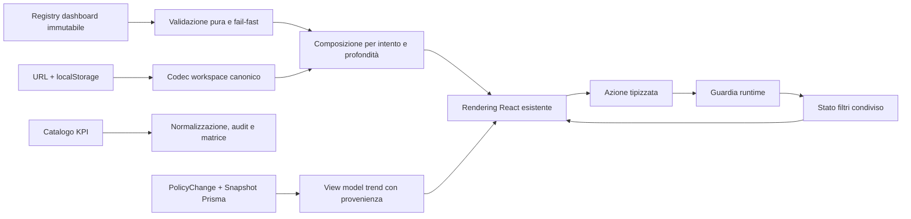

# Report di implementazione funzionale: dashboard nativa PolicyWatcher

- **Stato:** implementato e verificato
- **Data:** 2026-07-26
- **Baseline di studio:** Vizro `0.1.59`, commit `917d7663856534f14f8927ecebeb6c668f9444f6`
- **Vincolo rispettato:** nessuna dipendenza o componente runtime Vizro, Dash, Flask o Python

## Risultato esecutivo

PolicyWatcher dispone ora dei primi elementi di un motore dashboard nativo,
integrati nella home esistente senza sostituire React, Recharts, Next.js o
Prisma. Le idee utili osservate in Vizro sono state trasformate in contratti
PolicyWatcher-specifici con maggiore attenzione a evidenza, provenienza,
determinismo e configurazione non eseguibile.

Sono operative dieci capacità:

1. catalogo KPI canonico e field-specific;
2. trend con versione snapshot reale e sequenza eventi distinta;
3. registry dashboard immutabile con validazione fail-fast;
4. profilo workspace con codec unico per URL e localStorage;
5. dispatcher tipizzato condiviso da controlli UI e Command Palette;
6. registry evidence-first delle sorgenti dati pubbliche;
7. view model unico per rendering ed export con manifest di provenienza;
8. grafo statico e aciclico delle azioni;
9. contratto di layout multi-breakpoint con fallback mobile lineare;
10. `ChartSpec` allowlisted con frame accessibile applicato al trend di rischio.

## Flusso funzionale

## 1. Grammatica dashboard nativa

### Implementazione

`src/lib/dashboardGrammar.ts` introduce:

- versione dello schema dashboard;
- registry immutabile dei moduli;
- classificazione semantica e renderer allowlisted per ogni modulo;
- metadato `provenanceRequired`;
- specifiche immutabili per `citizen`, `grc`, `research` e `builder`;
- ID deterministici per specifiche e istanze modulo;
- validatore puro con errori strutturati.

Il validatore controlla:

- versione schema;
- coerenza tra chiave e ID;
- renderer non autorizzati;
- presenza del modulo di sicurezza `sourceQuality`;
- completezza degli intenti;
- ID deterministici;
- riferimenti a moduli inesistenti;
- moduli duplicati tra aree primarie e di supporto.

Il registry incorporato viene validato all'import. Una configurazione built-in
invalida interrompe l'avvio invece di produrre una dashboard parziale.

### Integrazione reale

`src/lib/dashboardComposer.ts` non contiene più blueprint paralleli: compone la
dashboard partendo dal registry validato. Il contratto pubblico precedente è
preservato e arricchito con:

- `specId`;
- `schemaVersion`.

La home espone entrambi come attributi DOM (`data-dashboard-spec` e
`data-dashboard-schema`), rendendo verificabile la configurazione attiva anche
da test end-to-end e strumenti di osservabilità.

Il modulo Source QA resta sempre in prima posizione e non può essere nascosto
dalla profondità selezionata.

## 2. Stato workspace e URL canonici

`src/lib/workspaceProfile.ts` centralizza la semantica precedentemente dispersa
nella home:

- parsing sicuro del profilo persistito;
- serializzazione canonica;
- normalizzazione case-insensitive;
- supporto in lettura del parametro legacy `workspace`;
- scrittura esclusiva del parametro canonico `intent`;
- conservazione degli altri filtri presenti nell'URL;
- ordinamento deterministico dei parametri;
- disattivazione di `onTheGo` per combinazioni incompatibili.

Valori JSON, intenti o profondità non validi non vengono applicati. Gli URL
espliciti mantengono precedenza sul profilo locale senza scrivere implicitamente
il marker permanente di onboarding.

## 3. Azioni e filtri tipizzati

`src/lib/dashboardActions.ts` definisce una union discriminata per:

- settore;
- rischio;
- regione;
- prospettiva;
- intervallo temporale;
- ricerca;
- reset completo.

Ogni azione dichiara sorgente, target, tipo e payload. La guardia runtime
consente soltanto sorgenti note, valori enumerati e stringhe entro limiti
espliciti. Il reducer puro permette di verificare le transizioni senza React.

Nella home, controlli manuali e Command Palette convergono ora sul medesimo
dispatcher. Una sorgente o un payload non valido viene rifiutato e non modifica
lo stato. Il reset riporta coerentemente filtri, regione, prospettiva e ordine ai
default pubblici.

## 4. Semantica KPI canonica

`src/lib/metricsCatalog.ts` è la fonte unica per:

- quindici campi KPI;
- categorie e label bilingui;
- vocabolario consentito;
- livello di criticità specifico per campo;
- valore esplicito `Not assessed`;
- confronto tra valori durante l'aggregazione.

Normalizzazione AI, audit amministrativo e matrice pubblica riutilizzano lo
stesso catalogo. L'assenza di valutazione rimane `pending` e non viene convertita
in un punteggio sintetico o in un livello di rischio basso.

## 5. Trend e provenienza

`src/lib/riskTrends.ts` costruisce un view model deterministico a partire dai
record pubblicabili Prisma. `/api/trends` recupera la relazione `newSnapshot` e
restituisce:

- `sequence`: posizione cronologica nel flusso osservato;
- `snapshotVersion`: versione reale della policy sorgente;
- azienda e policy;
- data ISO, rischio e punteggio;
- statistiche riepilogative.

Il client non inventa più una versione progressiva. Il tooltip mostra azienda,
policy, numero della rilevazione, versione snapshot e data localizzata.

## 6. Token grafici

`src/lib/chartTokens.ts` e le variabili in `src/app/globals.css` centralizzano
colori di serie, assi, griglia, cursore e livelli di rischio. Trend, profilo di
rischio e gauge usano ora lo stesso vocabolario visuale e possono essere
ritematizzati senza modificare i singoli componenti.

## 7. Data-source registry evidence-first

`src/lib/dataSourceRegistry.ts` registra le cinque sorgenti pubbliche usate
dalle superfici dashboard:

- aziende e policy;
- Market Pulse;
- sospensioni sorgenti;
- trend di rischio;
- matrice KPI.

Ogni sorgente dichiara endpoint locale, metodo, contesto di visibilità, gate di
evidenza, freshness e parametri query consentiti. URL e query key vengono
canonicalizzati e includono il contesto pubblico e il gate, evitando che
richieste semanticamente diverse condividano identità.

Il loader accetta soltanto endpoint e parametri registrati. Richieste identiche
contemporanee vengono accorpate finché sono in-flight; i risultati non vengono
conservati in una cache applicativa. Home, Market Pulse, Source QA, trend e
matrice usano ora questo loader.

## 8. View model ed export coerente

`src/lib/dashboardViewModel.ts` è la fonte unica per ricerca, settore, rischio,
periodo, ordinamento, regione e prospettiva. Produce:

- l'elenco esatto di aziende mostrato dalla home;
- il conteggio dei filtri attivi;
- un'identità deterministica della vista;
- copertura prima e dopo i filtri;
- data source, query key, gate e limitazioni.

La home renderizza `dashboardDataView.companies`. L'export riceve lo stesso
oggetto, senza rieseguire query o ricostruire separatamente i filtri.

Il CSV contiene una prima riga `manifest`, seguita dalle righe `policy`. Il
campo `ManifestJSON` registra schema della vista, filtri effettivi, copertura,
release PolicyWatcher, lingua, timestamp, numero di righe, source ID, gate,
query key e limitation keys. Anche un risultato vuoto conserva quindi il
manifest e resta verificabile.

## 9. Grafo statico delle azioni

`src/lib/dashboardActionGraph.ts` definisce nodi e archi autorizzati tra il
modulo filtri, la Command Palette e i controlli. Gli ID degli archi derivano in
modo deterministico da azione, sorgente e target.

La validazione fail-fast controlla:

- chiavi e ID dei nodi;
- ID degli archi duplicati o non deterministici;
- sorgenti e target inesistenti;
- self-loop;
- cicli mediante visita del grafo.

`validateDashboardAction` verifica ora prima l'esistenza dell'arco e soltanto
dopo il tipo del payload. Un payload formalmente valido non viene quindi
applicato se la sorgente non è autorizzata a scrivere quel controllo. La
Command Palette, per esempio, non può impostare direttamente il campo ricerca
perché quell'arco non è registrato.

L'identità del grafo attivo viene propagata dalla composizione alla home tramite
`data-dashboard-action-graph`.

## 10. Layout dichiarativo validato

`src/lib/dashboardLayout.ts` descrive placement per breakpoint `wide`,
`compact` e `mobile`. Il validatore richiede:

- numero di colonne valido;
- moduli conosciuti, presenti una sola volta e copertura completa;
- span compatibili con il breakpoint;
- presenza di Source QA;
- fallback mobile a singola colonna con span unitario.

Ogni modulo renderizzato riceve un ID deterministico, il proprio
`data-dashboard-module` e gli span dichiarati per i tre breakpoint. La home
espone anche l'identità del layout attivo. Il renderer CSS di compatibilità
mantiene l'impostazione attuale e forza larghezza completa e fallback mobile
lineare; il contratto può quindi evolvere senza riscrivere i componenti.

## 11. ChartSpec e frame accessibile

`src/lib/chartSpec.ts` introduce uno spec grafico immutabile e serializzabile
per il trend di rischio. Lo spec può dichiarare soltanto:

- renderer e trasformazioni allowlisted;
- campi dati e formatter conosciuti;
- dominio degli assi;
- testi bilingui;
- data source e gate coerenti con il registry;
- strategia di riepilogo e rappresentazioni non cromatiche;
- limitation keys e testo delle limitazioni.

Il validatore rifiuta renderer, trasformazioni, campi e formatter non noti,
domini invalidi, source/gate incoerenti, copy incompleta, requisiti di
accessibilità mancanti e qualsiasi valore eseguibile. Lo spec non può quindi
contenere callback, path di moduli o codice da risolvere dinamicamente.

`src/components/charts/AccessibleChartFrame.tsx` rende il contratto visibile e
accessibile tramite:

- titolo e descrizione associati al `figure`;
- riepilogo testuale bilingue dell'andamento;
- tabella dati completa espandibile;
- source ID ed evidence gate;
- limitazioni esplicite;
- identificatori `data-chart-*` verificabili.

`RiskTrendChart` usa lo spec per campi e dominio, mantiene Recharts come
renderer, genera ID unici per i gradienti SVG e disabilita l'animazione quando
l'utente richiede reduced motion. Nel pannello esistente il frame opera in
modalità embedded, evitando una seconda card visuale senza perdere struttura
semantica, riepilogo, tabella o provenienza.

## Compatibilità

- Nessuna route pubblica è stata rimossa.
- Nessun componente React è stato sostituito.
- Nessuna migrazione Prisma è richiesta.
- `composeDashboard`, visibilità e ordinamento conservano il comportamento
  precedente.
- Il parametro URL legacy `workspace` resta leggibile ed è normalizzato alla
  successiva scrittura.
- Recharts resta l'unico renderer grafico applicativo.

## Verifica eseguita

| Controllo | Esito |
| --- | --- |
| Test completi Vitest | 53 file, 290 test superati |
| Test nuovi/mirati | registry, composer, azioni, URL, KPI e trend superati |
| TypeScript | superato |
| ESLint | 0 errori; 1 warning preesistente sotto `tmp/` |
| Build di produzione | completata, 62 pagine generate |
| `git diff --check` | nessun errore di whitespace |

La build segnala soltanto l'avviso già esistente sulla futura rimozione della
configurazione Prisma in `package.json`; non è causato dal motore dashboard.

## Limiti intenzionali e prossima tranche

Non sono ancora presenti:

- caricamento di dashboard da configurazioni esterne;
- renderer generico basato su JSON;
- renderer generico che trasformi automaticamente placement esterni in grid
  arbitrarie; il renderer corrente resta intenzionalmente in compatibility mode.

Queste esclusioni sono intenzionali: prima vengono stabilizzati contratti e
invarianti sulle superfici esistenti. La prossima tranche consigliata è
estendere il contratto ChartSpec a profilo di rischio e gauge, introducendo un
registry dei renderer built-in senza consentire risoluzione dinamica.

## File principali

- `src/lib/dashboardGrammar.ts`
- `src/lib/dashboardComposer.ts`
- `src/lib/dashboardActions.ts`
- `src/lib/dashboardActionGraph.ts`
- `src/lib/dashboardLayout.ts`
- `src/lib/dataSourceRegistry.ts`
- `src/lib/dashboardViewModel.ts`
- `src/lib/workspaceProfile.ts`
- `src/lib/metricsCatalog.ts`
- `src/lib/riskTrends.ts`
- `src/lib/chartTokens.ts`
- `src/lib/chartSpec.ts`
- `src/components/charts/AccessibleChartFrame.tsx`
- `src/app/page.tsx`
- `src/app/api/matrix/route.ts`
- `src/app/api/trends/route.ts`
- `docs/architecture/vizro-patterns-knowledge-base.md`
- `docs/architecture/native-dashboard-engine.md`
