# PolicyWatcher v3.5.1 Architecture & Workflow Diagrams

Status: Confidence maintenance release
Purpose: reusable diagrams for documentation, presentations, audits, and third-party technical review.

These diagrams describe what PolicyWatcher does today. They use a certification boundary: the platform maps source-backed policy evidence, retrieval quality, changes, risk signals, and governance metadata.

## Diagram Inventory

1. System context
2. Runtime deployment topology
3. Policy ingestion cascade
4. Evidence gate and public exposure model
5. Seeded re-baseline versus real change workflow
6. Dataset QA lifecycle
7. Admin control plane
8. VPS operations lifecycle
9. Data model ERD
10. Security and trust boundaries
11. KPI assessment lifecycle
12. Source remediation workflow

---

## 1. System Context

Use this diagram to explain PolicyWatcher in one slide: who interacts with the platform, which services are involved, and where evidence enters the system.

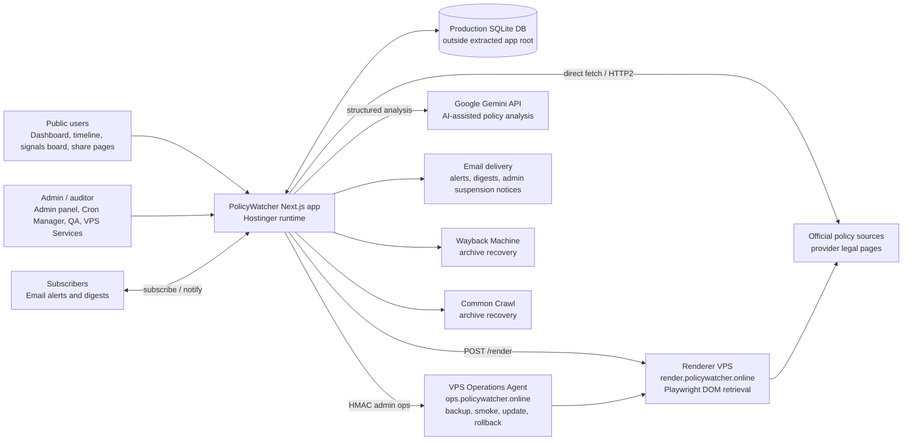

---

## 2. Runtime Deployment Topology

Use this diagram for infrastructure discussions. The key point is separation: Hostinger serves the product and APIs, while the VPS only provides controlled companion services.

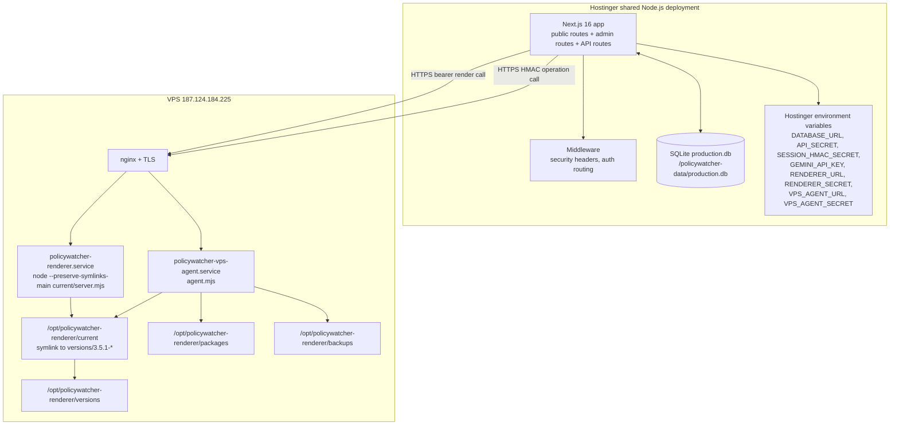

---

## 3. Policy Ingestion Cascade

Use this diagram to explain how a single policy source is fetched. Each step records diagnostics, reason, HTTP status where available, and escalation path.

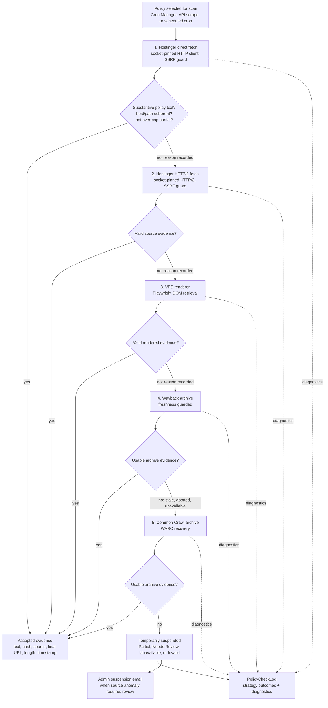

---

## 4. Evidence Gate And Public Exposure Model

Use this diagram for trust discussions. Public routes do not simply read "anything in the database"; they read source-gated evidence.

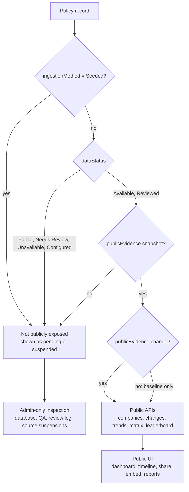

---

## 5. Seeded Re-Baseline Versus Real Change

Use this diagram to explain the red-team hardening decision: first real evidence replaces seed data, but does not create a fake market event.

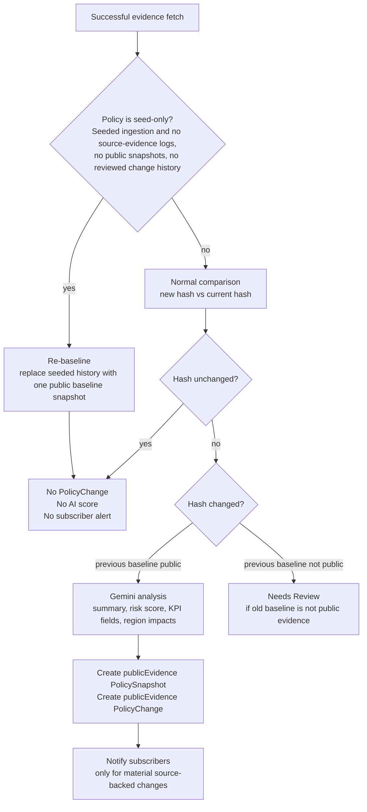

---

## 6. Dataset QA Lifecycle

Use this diagram to show that dataset quality is not cosmetic. It is an operational control loop.

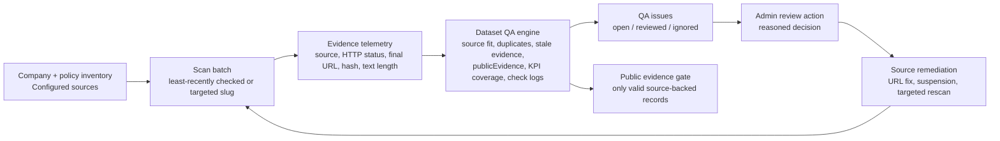

---

## 7. Admin Control Plane

Use this diagram to explain what the admin area controls and how it supports operations, QA, and auditing.

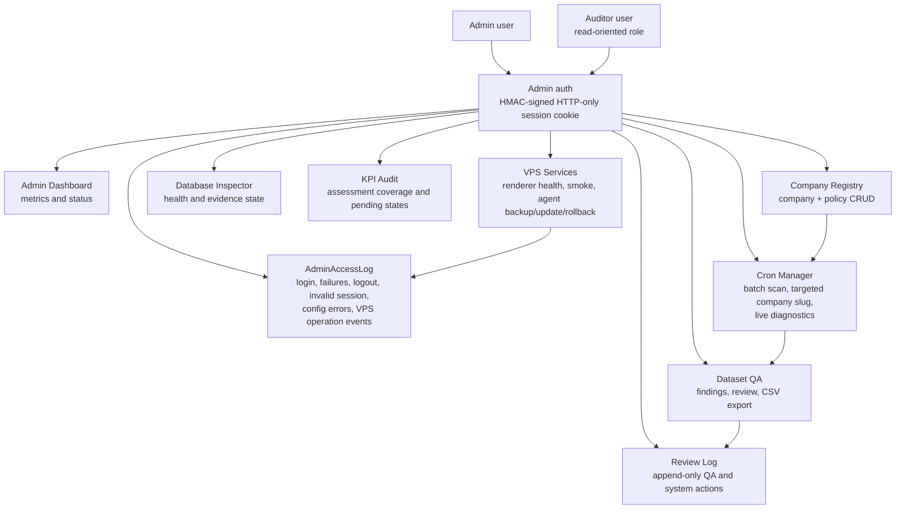

---

## 8. VPS Operations Lifecycle

Use this diagram for operational handover. The admin panel never sends shell commands or arbitrary package URLs.

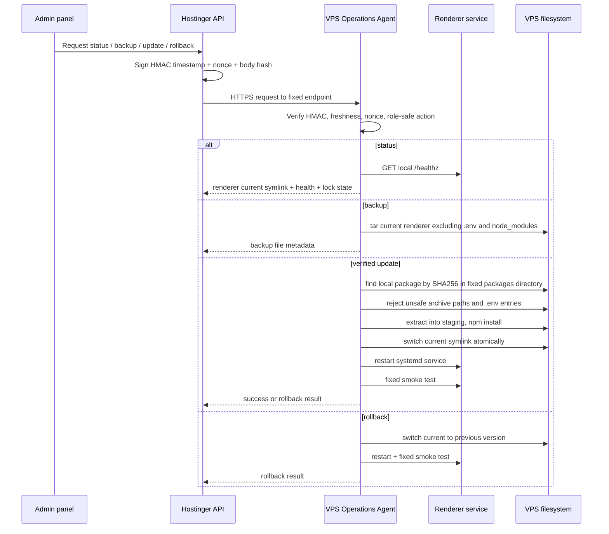

---

## 9. Data Model ERD

Use this diagram for technical audit and onboarding.

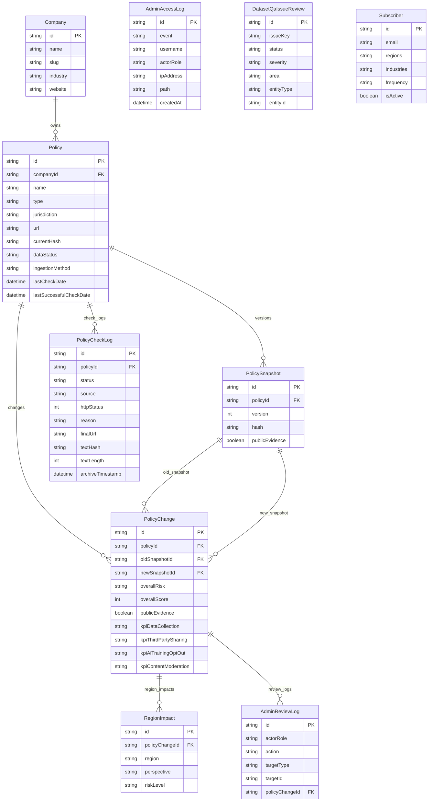

---

## 10. Security And Trust Boundaries

Use this diagram with auditors. It separates public access, admin authority, server-side secrets, renderer capability, and update authority.

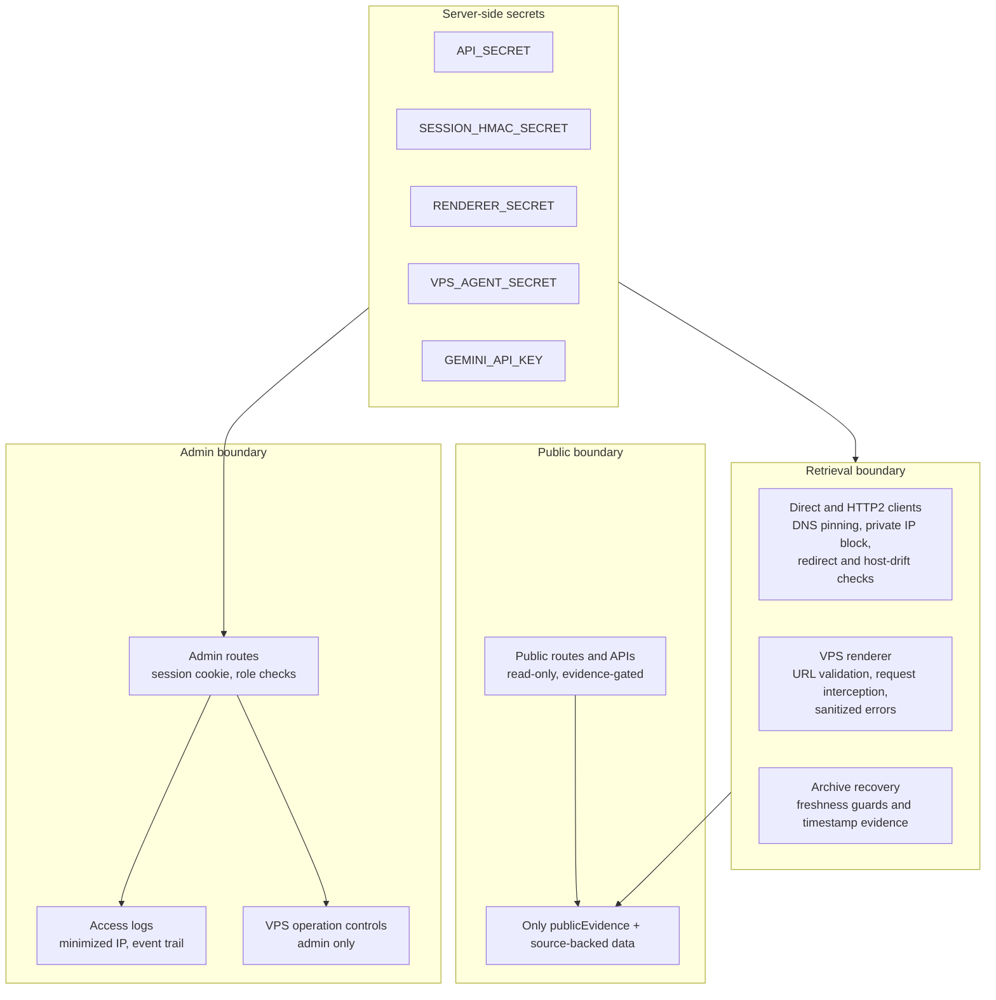

---

## 11. KPI Assessment Lifecycle

Use this diagram to explain why a source-verified baseline can still show KPI assessment pending.

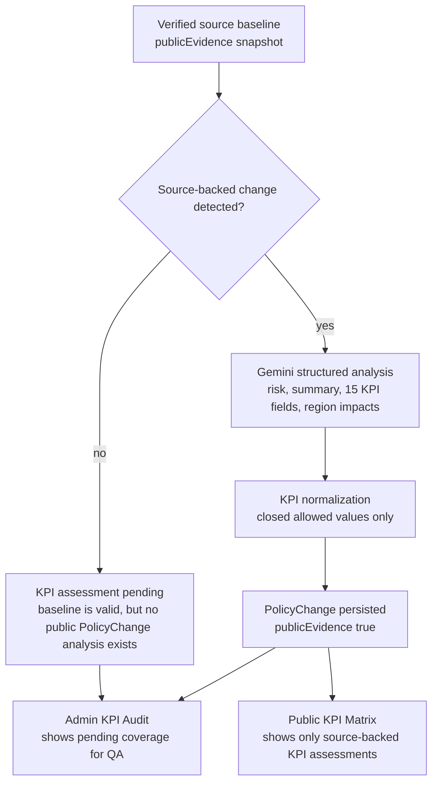

Planned extension: a dedicated `PolicyBaselineAssessment` model can assess verified baselines without inventing a `PolicyChange`. This would populate the KPI matrix from current source evidence while preserving the timeline as change-only.

---

## 12. Source Remediation Workflow

Use this diagram when explaining how problematic sources such as blocked, broad, localized, duplicated, or stale URLs are handled.

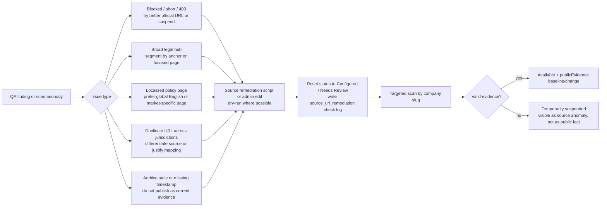

---

## Presentation Reading Path

For a short executive presentation, use this order:

1. System Context
2. Runtime Deployment Topology
3. Policy Ingestion Cascade
4. Evidence Gate And Public Exposure Model
5. Dataset QA Lifecycle
6. Admin Control Plane
7. VPS Operations Lifecycle
8. Security And Trust Boundaries

For a technical audit, use this order:

1. Runtime Deployment Topology
2. Security And Trust Boundaries
3. Policy Ingestion Cascade
4. Seeded Re-Baseline Versus Real Change
5. Data Model ERD
6. Dataset QA Lifecycle
7. VPS Operations Lifecycle
8. KPI Assessment Lifecycle
