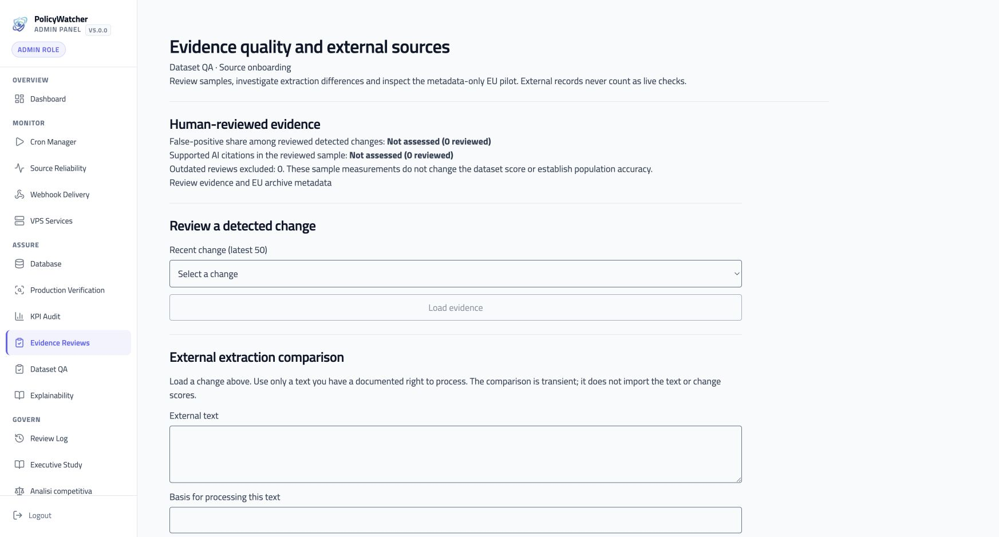

# Evidence assurance release · 7 October 2026

**Production activated and verified.** PolicyWatcher 5.0.0 now runs the five assurance features at [policywatcher.online](https://policywatcher.online). The extraction guard is enabled and scans are resumed. The [protected Evidence Reviews workbench](https://policywatcher.online/admin/evidence-quality) provides human reviews, external metadata and transient comparison. The [machine-readable receipt](release-receipt.json) records the observation times and limits.

## Artifact and promotion

- Immutable artifact: `PolicyWatcher-5.0.0-hostinger-2026-10-07-evidence-assurance-r1.zip`.
- SHA-256: `48e84b70c1f4b63fb295629bdb89a7beb6e434a42338eaeb587493516d6114df`.
- Clean source commit: `f54e8dfaff0512d59349d4920afaff058fd328b6`; implementation [PR #23](https://github.com/sev7enITA/policywatcher/pull/23) merged as `5634609a9fa3b8080a6f7e5ea12e04329c7d411c`.
- The same ZIP passed all 11 [staging checks](staging-verification.json) at 04:25:49 UTC and was promoted under the user's explicit production instruction. Hostinger reported the production deployment Completed / Current. Same-artifact redeployment resumed scans.
- The post-resume API check at 04:36:34 UTC reports guard enabled, scans unpaused, authenticated access and 34 tables / 18 migrations. [Production checks](production-assurance.json).
- All 937 checked source, script, schema, public and documentation files in production `last-source` match the promoted ZIP. This verifies deployed source provenance; runtime behavior is verified separately. [Source comparison](production-source-integrity.json).

Two fresh WAL-aware production backups were made and passed SQLite integrity checks. The final pre-promotion backup was captured at 04:27:08 UTC. Private database files, secrets and backup paths are excluded from Git. Staging uses a separate sanitized database.

## Data and extraction readiness

Production retains 18 companies, 113 configured policies, 199 snapshots and 79 recorded policy changes. The publication gate exposes 109 policies; configured inventory, public evidence and extraction readiness are different denominators. Eleven of twelve checked table fingerprints remain identical, including snapshots, changes, canonical evidence and subscribers. `PolicyCheckLog` gains one entry rejecting an archive result as live confirmation. [Preservation receipt](database-preservation.json).

The deployment-only readiness pass anchors **107 exact live matches out of 113 configured policies**, without AI, notifications or new provider-change records. Six records remain unresolved:

| Company | Finding | Handling |
|---|---|---|
| OpenAI | Different extraction from a direct source | Baseline review required |
| Stripe | Different extraction from a direct source | Baseline review required |
| TikTok | Different extraction from an archive result | Baseline review required; archive is not live evidence |
| X/Twitter | Different extraction from an archive result | Baseline review required; archive is not live evidence |
| Amazon | Archive-only result | Excluded from live confirmation |
| Coca-Cola | Incomplete retrieval | No baseline established |

These are readiness findings, not reviewed semantic changes. The deployment CLI reports the four differences without automatically approving or queuing recovery decisions. Subsequent normal scans use the guard and review path. Do not replace their evidence to manufacture full coverage. [Production readiness](production-readiness.json).

Staging separately anchored 101 exact live matches, reported eight baseline differences, three incomplete retrievals and one archive exclusion. Its manual and scheduled Google scans both succeeded without changes, AI or notifications. [Staging readiness](staging-readiness.json), [live scan checks](staging-live-scans.json).

## EU metadata and reviewed quality

Seven bounded Google/OpenAI/Meta documents contribute 16 references at collection HEAD `0dbd93e5c9b3af461ae31afb9d6b73760b6270c3`. References retain Git provenance, license and attribution; they remain proposals requiring applicability review. No full provider text was imported from the EU collection, and no retrospective alerts or public KPI changes were created.

Hosting-side retrieval stalled and was stopped before import. The native adapter was then run locally against the official API; its metadata receipt was transferred with SHA-256 verification and imported atomically. The staging import was repeated and stayed at 16 references; production also has 16. All imports retained 79 provider-change records. [Import receipts](eu-imports.json), [source and reuse assessment](../eu-terms-reuse-2026-10-07/assessment-it.md).

Production has **zero assessed human-review samples**. Both new metrics correctly return null / Not assessed with denominator zero. This release does not establish improved real-world accuracy. Staging-only unassessed test reviews were not copied to production. The transient comparison remains diagnostic and requires acknowledged scope and processing basis.

## Validation and public assets

- Local release validation: 1,164 tests passed and 14 skipped; build, application and critical-test typechecks passed; lint has zero errors and 15 pre-existing navigation warnings. Production dependency audit reports zero vulnerabilities.
- PR #23 checks passed, including quality, PostgreSQL migration/runtime/SQLite-to-PostgreSQL rehearsal, CodeQL and Sonar.
- HTTP and content crawl: **521/521 URLs return 200** in both [staging](staging-pages.json) and [production](production-pages.json), with no detected application errors, stale current-release references or old builds. This is a route/content check, not exhaustive interactive testing of every flow.
- The production crawl used the promoted ZIP before the final scan-resume redeployment; authenticated API/health checks verified the same artifact after resumption. Browser inspection verified the actual production workbench and staging methodology/Feature Atlas. Initial local workbench checks covered desktop and mobile viewports.
- Methodology in both languages, five Feature Atlas entries, Site Atlas, newsroom, changelog, README, packaging inventory and deployment runbook are updated. The 6 October release date and historical assets remain dated; this is an operational update to 5.0.0.
- Existing Production Verification remains **8 passed / 1 attention / 1 external**: the pre-existing security-header attention and external independent test are not converted into success by this rollout.
- The main-branch OpenSSF job hit an upstream GCR billing error with action v2.4.0. The follow-up workflow pins official v2.4.4 (GHCR) without broadening permissions. Its CI result is tracked separately from application runtime verification.

The release ZIP remains immutable. Subsequent receipt/documentation and CI workflow changes do not modify the deployed application artifact. Rollback instructions and evidence boundaries remain in the [runbook](../../evidence-assurance-pilot.md).

