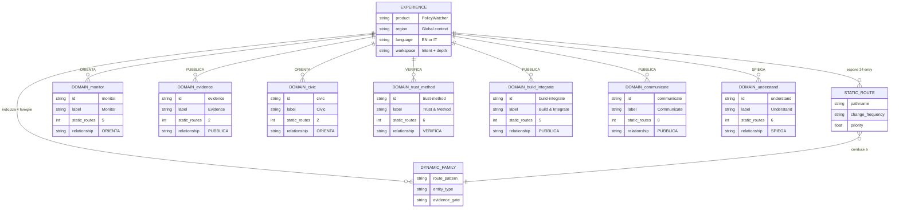

# PolicyWatcher sitemap ER – agosto 2026

Il modello separa l’esperienza globale dai sette domini informativi. Le **34 route statiche** provengono direttamente da `src/app/sitemap.ts`; le quattro famiglie dinamiche descrivono entità indicizzate solo quando superano i rispettivi gate pubblici.

## Grafo ER

## Domini e route

### Monitor

Relazione con l’esperienza: **ORIENTA**.

- `/`
- `/observatory`
- `/timeline`
- `/what-changed`
- `/leaderboard`

### Evidence

Relazione con l’esperienza: **PUBBLICA**.

- `/evidence`
- `/collections`

### Civic

Relazione con l’esperienza: **ORIENTA**.

- `/en/associations`
- `/it/associazioni`

### Trust & Method

Relazione con l’esperienza: **VERIFICA**.

- `/trust`
- `/trust/residency`
- `/methodology/confidence`
- `/security`
- `/privacy`
- `/terms`

### Build & Integrate

Relazione con l’esperienza: **PUBBLICA**.

- `/developers`
- `/developers/event-continuity`
- `/developers/webhook-readiness`
- `/integrations`
- `/browser-extension`

### Communicate

Relazione con l’esperienza: **PUBBLICA**.

- `/press`
- `/press-kit`
- `/pulse`
- `/press-kit/releases`
- `/press-kit/data`
- `/press-kit/reference`
- `/press-kit/corrections`
- `/press-kit/glossary`

### Understand

Relazione con l’esperienza: **SPIEGA**.

- `/showcase`
- `/atlas`
- `/feature-atlas`
- `/infographics`
- `/roadmap`
- `/about`

## Famiglie dinamiche

| Famiglia | Pattern | Entità | Dominio |
| --- | --- | --- | --- |
| change | `/change/{changeId}` | PolicyChange | Monitor |
| knowledge | `/knowledge → /companies/{slug} → /policies/{policyId}` | Company + Policy | Evidence |
| release | `/press-kit/releases/{slug}` | PressRelease | Communicate |
| pulse | `/pulse/{slug}` | PulseStory | Communicate |

## Asset editoriale

- PNG sorgente: `public/infographics/policywatcher-experience-map-er-sitemap-2026-08.png`
- WebP ottimizzato: `public/infographics/policywatcher-experience-map-er-sitemap-2026-08.webp`

Il poster rappresenta l’architettura editoriale; il file Mermaid e l’inventario JSON restano la fonte esatta per route e relazioni.
